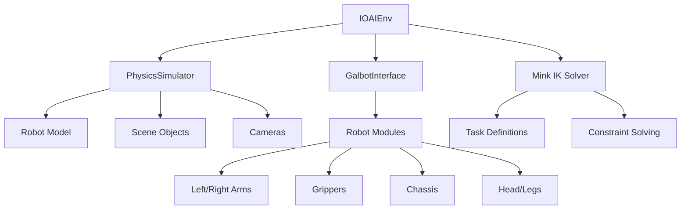

# IOAI Base Environment (ioai_env.py)

The `IOAIEnv` class serves as the foundational environment for all IOAI robotics simulations. It provides core functionality for robot control, inverse kinematics, and basic manipulation tasks.

## 🏗️ Architecture Overview



## 🔧 Core Components

### 1. Simulator Setup

The environment initializes a MuJoCo-based physics simulator with a Galbot robot:

```python
def _setup_simulator(self, headless=False):
    """Setup the physics simulator with robot and sensors"""
    
    # Create simulator configuration
    sim_config = PhysicsSimulatorConfig(
        mujoco_config=MujocoConfig(headless=headless)
    )
    
    # Initialize simulator
    self.simulator = PhysicsSimulator(sim_config)
    self.simulator.add_default_scene()
    
    # Add Galbot robot
    robot_config = RobotConfig(
        prim_path="/World/Galbot",
        name="galbot_one_foxtrot",
        mjcf_path=Path()
            .joinpath(self.simulator.synthnova_assets_directory)
            .joinpath("synthnova_assets")
            .joinpath("robots")
            .joinpath("galbot_one_foxtrot_description_simplified")
            .joinpath("galbot_one_foxtrot.xml"),
        position=[0, 0, 0],
        orientation=[0, 0, 0, 1]
    )
    self.simulator.add_robot(robot_config)
```

### 2. Robot Interface Configuration

The interface manages all robot modules and their joint configurations:

```python
def _setup_interface(self):
    """Configure the Galbot interface with all robot modules"""
    
    galbot_interface_config = GalbotInterfaceConfig()
    galbot_interface_config.robot.prim_path = "/World/Galbot"
    
    robot_name = self.robot.name
    
    # Enable robot modules
    enabled_modules = [
        "right_arm", "left_arm", "leg", "head", 
        "chassis", "left_gripper", "right_gripper", 
        "front_head_camera"
    ]
    galbot_interface_config.modules_manager.enabled_modules.extend(enabled_modules)
    
    # Configure joint names for each module
    galbot_interface_config.right_arm.joint_names = [
        f"{robot_name}/right_arm_joint{i}" for i in range(1, 8)
    ]
    galbot_interface_config.left_arm.joint_names = [
        f"{robot_name}/left_arm_joint{i}" for i in range(1, 8)  
    ]
    # ... (other joint configurations)
```

### 3. Inverse Kinematics Setup

The environment uses the Mink library for robust IK solving:

```python
def _setup_mink(self):
    """Initialize Mink IK solver with robot model and tasks"""
    
    # Load robot configuration from MuJoCo model
    model_path = str(Path(self.simulator.synthnova_assets_directory) / 
                    "synthnova_assets" / "robots" / 
                    "galbot_one_foxtrot_description_simplified" / 
                    "galbot_one_foxtrot.xml")
    
    # Create Mink configuration
    self.mink_config = mink.Configuration(model_path)
    
    # Define IK tasks for different robot components
    self.tasks = {
        "left_arm": mink.FrameTask(
            frame_name=f"{self.robot.namespace}left_gripper_tcp",
            frame_type="site",
            position_cost=1.0,
            orientation_cost=1.0,
        ),
        "right_arm": mink.FrameTask(
            frame_name=f"{self.robot.namespace}right_gripper_tcp", 
            frame_type="site",
            position_cost=1.0,
            orientation_cost=1.0,
        ),
        "posture": mink.PostureTask(cost=1e-3),
        # ... (other task definitions)
    }
```

## 🎯 Key Functionality

### Coordinate Frame Transformations

The environment provides utilities for converting between different coordinate frames:

```python
def world_to_robot_frame(self, world_position, world_orientation):
    """Transform pose from world frame to robot base frame"""
    
    # Get robot base pose in world frame
    base_position = self.robot.position
    base_orientation = self.robot.orientation
    
    # Create rotation objects
    base_rot = Rotation.from_quat(base_orientation)
    world_rot = Rotation.from_quat(world_orientation)
    
    # Transform position
    relative_position = world_position - base_position
    robot_position = base_rot.inv().apply(relative_position)
    
    # Transform orientation
    robot_orientation = (base_rot.inv() * world_rot).as_quat()
    
    return robot_position, robot_orientation
```

### Inverse Kinematics Solving

The core IK solver computes joint positions to reach target end-effector poses:

```python
def compute_simple_ik(self, start_joint, target_pose, arm_id="left_arm"):
    """
    Compute IK solution for target end-effector pose
    
    Args:
        start_joint: Initial joint configuration [7 DOF]
        target_pose: Target pose [position(3), orientation(4)]
        arm_id: Target arm ("left_arm" or "right_arm")
        
    Returns:
        Joint positions to achieve target pose
    """
    
    # Set initial joint configuration
    self.mink_config.q[arm_joint_indexes] = start_joint
    
    # Extract target position and orientation
    world_position = target_pose[:3]
    world_orientation = target_pose[3:]
    
    # Set up tasks for IK solving
    if arm_id == "left_arm":
        target = mink.SE3.from_rotation_and_translation(
            rotation=mink.SO3(wxyz=xyzw_to_wxyz(world_orientation)),
            translation=world_position
        )
        self.tasks["left_arm"].set_target(target)
        tasks = [self.tasks["torso"], self.tasks["posture"], 
                self.tasks["chassis"], self.tasks["left_arm"]]
    
    # Iterative IK solving
    dt = 1e-3
    max_iterations = 50
    
    for iteration in range(max_iterations):
        # Solve for joint velocities
        vel = mink.solve_ik(
            self.mink_config, tasks, dt, self.solver, self.damping
        )
        
        # Integrate velocities to update configuration
        self.mink_config.integrate_inplace(vel, dt)
        
        # Check convergence
        error = self.tasks[arm_id].compute_error(self.mink_config)
        if np.linalg.norm(error[:3]) < 1e-4 and np.linalg.norm(error[3:]) < 1e-4:
            break
    
    return self.mink_config.q[arm_joint_indexes]
```

### Forward Kinematics

Computing end-effector pose from joint angles:

```python
def compute_simple_fk(self, arm_id="left_arm"):
    """
    Compute forward kinematics for current joint configuration
    
    Args:
        arm_id: Target arm for FK computation
        
    Returns:
        End-effector pose [position(3), orientation(4)]
    """
    
    # Get TCP (Tool Center Point) transformation matrix
    if arm_id == "left_arm":
        tcp_name = f"{self.robot.namespace}left_gripper_tcp"
    else:
        tcp_name = f"{self.robot.namespace}right_gripper_tcp"
    
    # Build transformation matrix
    tmat = np.eye(4)
    tmat[:3, :3] = self.simulator.data.site(tcp_name).xmat.reshape((3, 3))
    tmat[:3, 3] = self.simulator.data.site(tcp_name).xpos
    
    # Extract position and orientation
    position = tmat[:3, 3]
    rotation_matrix = tmat[:3, :3]
    quaternion = Rotation.from_matrix(rotation_matrix).as_quat()
    
    return np.concatenate([position, quaternion])
```

### Smooth Joint Motion

The environment provides utilities for smooth joint trajectory execution:

```python
def _move_joints_to_target(self, module, target_positions, steps=500):
    """Execute smooth joint motion to target positions"""
    
    current_positions = module.get_joint_positions()
    
    # Generate interpolated trajectory
    positions = interpolate_joint_positions(
        current_positions, target_positions, steps
    )
    
    # Create joint trajectory
    joint_trajectory = JointTrajectory(positions=np.array(positions))
    
    # Execute trajectory
    module.follow_trajectory(joint_trajectory)
```

## 🎮 Usage Examples

### Basic Robot Control

```python
# Initialize environment
env = IOAIEnv(headless=False)

# Define target pose for left arm
target_pose = np.array([0.5, 0.3, 1.2, 0, 0, 0, 1])  # [pos(3), quat(4)]

# Get current joint positions
current_joints = env.interface.left_arm.get_joint_positions()

# Compute IK solution
target_joints = env.compute_simple_ik(current_joints, target_pose, "left_arm")

# Execute motion
env._move_left_arm_to_pose(target_pose[:3], target_pose[3:])

# Run simulation
env.simulator.loop()
```

### Custom Callback Integration

```python
def custom_control_callback():
    """Custom control logic executed each simulation step"""
    
    # Get current robot state
    left_gripper_pose = env.get_left_gripper_pose()
    right_gripper_pose = env.get_right_gripper_pose()
    
    # Implement custom control logic
    if some_condition:
        target_pose = compute_target_pose()
        env._move_left_arm_to_pose(target_pose[:3], target_pose[3:])

# Add callback to simulator
env.simulator.add_physics_callback("custom_control", custom_control_callback)
```

## 🧮 Mathematical Background

### Homogeneous Transformations

The environment uses 4×4 homogeneous transformation matrices for pose representation:

$$T = \begin{bmatrix} R & t \\ 0^T & 1 \end{bmatrix}$$

Where:
- $R \in SO(3)$ is the 3×3 rotation matrix
- $t \in \mathbb{R}^3$ is the translation vector

### Quaternion Mathematics

Quaternions $q = [x, y, z, w]$ provide singularity-free orientation representation:

$$q = w + xi + yj + zk$$

Where $i^2 = j^2 = k^2 = ijk = -1$

Quaternion composition for sequential rotations:
$$q_{12} = q_1 \otimes q_2$$

### IK Optimization Problem

The inverse kinematics is formulated as a constrained optimization:

$$\min_{q} \sum_i w_i ||e_i(q)||^2$$

Subject to:
- Joint limits: $q_{min} \leq q \leq q_{max}$
- Velocity limits: $|\dot{q}| \leq \dot{q}_{max}$

Where $e_i(q)$ represents task errors for different objectives.

## 🔍 Debugging and Monitoring

### State Inspection

```python
# Get current robot state
robot_state = env.simulator.get_robot_state("/World/Galbot")
print(f"Robot position: {robot_state['position']}")
print(f"Robot orientation: {robot_state['orientation']}")

# Monitor joint positions
left_arm_joints = env.interface.left_arm.get_joint_positions()
right_arm_joints = env.interface.right_arm.get_joint_positions()
```

### Error Analysis

```python
# Check IK convergence
target_pose = np.array([0.5, 0.3, 1.2, 0, 0, 0, 1])
computed_joints = env.compute_simple_ik(current_joints, target_pose, "left_arm")

# Verify solution with forward kinematics
actual_pose = env.compute_simple_fk("left_arm")
position_error = np.linalg.norm(actual_pose[:3] - target_pose[:3])
orientation_error = np.linalg.norm(actual_pose[3:] - target_pose[3:])

print(f"Position error: {position_error:.6f} m")
print(f"Orientation error: {orientation_error:.6f}")
```

## 📚 References

- [Mink IK Solver Documentation](https://github.com/stephane-caron/mink)
- [MuJoCo Physics Engine](https://mujoco.org/)
- [SciPy Spatial Transformations](https://docs.scipy.org/doc/scipy/reference/spatial.transform.html)
- [Robotics: Modelling, Planning and Control](http://www.springer.com/book/9781846286414)

---

**Next**: [Grasp Environment →](IOAI%20Grasp%20Environment.md)
