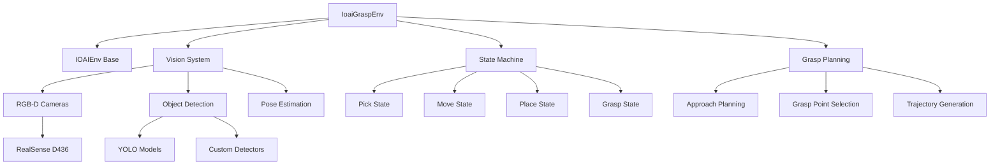

# IOAI Grasp Environment (ioai_grasp_env.py)

The `IoaiGraspEnv` class extends the base IOAI environment to provide sophisticated object manipulation capabilities with integrated computer vision. This environment is designed for pick-and-place tasks, object detection, and learning-based manipulation algorithms.

## 🎯 Core Features

- **Vision-Guided Manipulation**: RGB-D camera integration with object detection
- **State Machine Control**: Robust task execution with state management
- **Dual-Arm Coordination**: Simultaneous control of left and right manipulators
- **Real-time Object Tracking**: Continuous object pose estimation
- **Modular Vision Pipeline**: Pluggable vision models (YOLO, custom networks)

## 🏗️ Architecture Overview



## 🔧 Environment Setup

### Simulator Configuration

The grasp environment creates a tabletop manipulation scenario:

```python
def _setup_simulator(self, headless=False):
    """Setup manipulation environment with objects and cameras"""
    
    # Initialize base simulator
    sim_config = PhysicsSimulatorConfig(
        mujoco_config=MujocoConfig(headless=headless)
    )
    self.simulator = PhysicsSimulator(sim_config)
    self.simulator.add_default_scene()
    
    # Add Galbot robot at origin
    robot_config = RobotConfig(
        prim_path="/World/Galbot",
        name="galbot_one_foxtrot",
        mjcf_path=Path()
            .joinpath(self.simulator.synthnova_assets_directory)
            .joinpath("synthnova_assets")
            .joinpath("robots")
            .joinpath("galbot_one_foxtrot_description_simplified")
            .joinpath("galbot_one_foxtrot.xml"),
        position=[0, 0, 0],
        orientation=[0, 0, 0, 1]
    )
    self.simulator.add_robot(robot_config)
    self.robot = self.simulator.get_robot("/World/Galbot")
```

### Scene Objects

The environment includes typical manipulation objects:

```python
# Add manipulation table
table_config = MeshConfig(
    prim_path="/World/Table",
    mjcf_path=Path()
        .joinpath(self.simulator.synthnova_assets_directory)
        .joinpath("synthnova_assets")
        .joinpath("objects")
        .joinpath("table")
        .joinpath("table.xml"),
    position=[0.65, 0, 0],
    orientation=[0, 0, 0.70711, 0.70711],  # 45° rotation
)
self.simulator.add_object(table_config)

# Add target objects for manipulation
cube_config = CuboidConfig(
    prim_path="/World/Cube",
    position=[0.65, 0.2, 0.56],  # On table surface
    orientation=[0, 0, 0, 1],
    scale=[0.05, 0.05, 0.05],  # 5cm cube
    color=[0.5, 0.5, 0.5],     # Gray color
)
self.simulator.add_object(cube_config)

# Add collection bin
bin_config = MeshConfig(
    prim_path="/World/Bin",
    mjcf_path=Path()
        .joinpath(self.simulator.synthnova_assets_directory)
        .joinpath("synthnova_assets")
        .joinpath("objects")
        .joinpath("bin")
        .joinpath("bin.xml"),
    position=[0.7, -0.1, 0.55],
    orientation=[0, 0, 0.70711, 0.70711],
)
self.simulator.add_object(bin_config)
```

### Vision System Setup

RGB-D cameras are mounted on the robot's head for object perception:

```python
# RGB Camera Configuration
front_head_rgb_camera_config = RgbCameraConfig(
    name="front_head_rgb_camera",
    prim_path=os.path.join(
        self.robot.prim_path,
        "head_link2",
        "head_end_effector_mount_link", 
        "front_head_rgb_camera",
    ),
    translation=[0.10084, -0.05904, 0.03185],  # Camera offset
    rotation=[-0.16546, 0.69356, 0.16457, 0.68155],  # Camera orientation
    camera_axes="ros",  # ROS convention
    sensor_config=RealsenseD436RgbSensorConfig(),
    parent_entity_name="galbot_one_foxtrot/head_end_effector_mount_link"
)

# Depth Camera Configuration
front_head_depth_camera_config = DepthCameraConfig(
    name="front_head_depth_camera",
    prim_path=os.path.join(
        self.robot.prim_path,
        "head_link2", 
        "head_end_effector_mount_link",
        "front_head_depth_camera",
    ),
    # ... same positioning as RGB camera
    sensor_config=RealsenseD436DepthSensorConfig(),
)
```

## 🎮 Vision Integration

### Object Detection Pipeline

The environment supports pluggable vision models for object detection:

```python
class VisionModelInterface:
    """Abstract interface for vision-based object detection"""
    
    def detect_objects(self, rgb_image, depth_image) -> List[DetectedObject]:
        """
        Detect objects in RGB-D images
        
        Args:
            rgb_image: RGB image array [H, W, 3]
            depth_image: Depth image array [H, W]
            
        Returns:
            List of detected objects with poses
        """
        raise NotImplementedError

@dataclass 
class DetectedObject:
    """Data class for detected object information"""
    class_name: str          # Object class (e.g., "cube", "bottle")
    confidence: float        # Detection confidence [0, 1]
    position: np.ndarray     # 3D position in camera frame
    orientation: np.ndarray  # Quaternion orientation [x, y, z, w]
    bounding_box: Tuple[int, int, int, int]  # 2D bbox (x1, y1, x2, y2)
```

### Real-time Object Detection

The environment continuously monitors objects in the scene:

```python
def detect_objects_vision(self) -> List[DetectedObject]:
    """Detect objects using vision model with frequency control"""
    
    current_time = time.time()
    
    # Limit detection frequency to reduce computation
    if current_time - self.last_detection_time < self.detection_interval:
        return self.detected_objects
    
    # Get current camera images
    rgb_image, depth_image = self.get_camera_images()
    
    if rgb_image is None:
        return self.detected_objects
    
    # Run object detection
    detected_objects = self.vision_model.detect_objects(rgb_image, depth_image)
    
    # Update cached results
    self.detected_objects = detected_objects
    self.last_detection_time = current_time
    
    return detected_objects
```

### Camera Image Acquisition

```python
def get_camera_images(self):
    """Get RGB and depth images from head-mounted cameras"""
    
    try:
        # Get RGB image
        rgb_data = self.interface.front_head_camera.get_rgb_image()
        if rgb_data is None:
            return None, None
            
        rgb_image = np.array(rgb_data).astype(np.uint8)
        
        # Get depth image  
        depth_data = self.interface.front_head_camera.get_depth_image()
        depth_image = np.array(depth_data).astype(np.float32) if depth_data else None
        
        return rgb_image, depth_image
        
    except Exception as e:
        print(f"Error getting camera images: {e}")
        return None, None
```

## 🎯 State Machine Control

The environment uses a finite state machine for robust task execution:

```python
def pick_and_place_callback(self):
    """State machine for pick-and-place task execution"""
    
    current_time = time.time()
    
    def detect_object_state():
        """State 1: Detect target object using vision"""
        print("State: Detecting objects...")
        
        detected_objects = self.detect_objects_vision()
        target_obj = None
        
        # Find target object (e.g., cube)
        for obj in detected_objects:
            if obj.class_name == "cube" and obj.confidence > 0.5:
                target_obj = obj
                break
        
        if target_obj:
            # Convert camera frame pose to world frame
            world_pos, world_ori = self.camera_to_world_frame(
                target_obj.position, target_obj.orientation
            )
            self.target_object_pose = (world_pos, world_ori)
            return "move_to_pick"  # Transition to next state
        
        return "detect_object"  # Stay in current state
    
    def move_to_pick_state():
        """State 2: Move arm to pre-grasp position"""
        print("State: Moving to pick position...")
        
        if not hasattr(self, 'target_object_pose'):
            return "detect_object"
        
        # Calculate approach pose (above object)
        world_pos, world_ori = self.target_object_pose
        approach_pos = world_pos + np.array([0, 0, 0.1])  # 10cm above
        
        # Convert to robot frame
        robot_pos, robot_ori = self.world_to_robot_frame(approach_pos, world_ori)
        
        # Execute arm motion
        if self._move_left_arm_to_pose(robot_pos, robot_ori):
            return "pick_object"  # Motion complete
        
        return "move_to_pick"  # Continue motion
    
    def pick_object_state():
        """State 3: Execute grasping motion"""
        print("State: Picking object...")
        
        # Move to grasp position
        world_pos, world_ori = self.target_object_pose  
        robot_pos, robot_ori = self.world_to_robot_frame(world_pos, world_ori)
        
        if self._move_left_arm_to_pose(robot_pos, robot_ori):
            # Close gripper
            self.interface.left_gripper.set_joint_positions([0.8], immediate=True)
            time.sleep(0.5)  # Allow grasp to stabilize
            return "move_to_place"
        
        return "pick_object"
    
    def move_to_place_state():
        """State 4: Move to drop location"""
        print("State: Moving to place position...")
        
        # Move to bin location
        world_pos = self.bin_position + np.array([0, 0, 0.3])  # Above bin
        world_ori = np.array([0, 0.7071, 0, 0.7071])  # Fixed orientation
        
        robot_pos, robot_ori = self.world_to_robot_frame(world_pos, world_ori)
        
        if self._move_left_arm_to_pose(robot_pos, robot_ori):
            return "place_object"
        
        return "move_to_place"
    
    def place_object_state():
        """State 5: Release object"""
        print("State: Placing object...")
        
        # Open gripper to release object
        self.interface.left_gripper.set_joint_positions([0.0], immediate=True)
        time.sleep(0.5)
        
        print("Pick and place completed!")
        return "detect_object"  # Reset for next cycle
    
    # State machine execution
    state_functions = {
        "detect_object": detect_object_state,
        "move_to_pick": move_to_pick_state, 
        "pick_object": pick_object_state,
        "move_to_place": move_to_place_state,
        "place_object": place_object_state,
    }
    
    # Execute current state
    current_state = self.state_machine.get_current_state()
    if current_state is None:
        self.state_machine.set_state("detect_object")
        current_state = "detect_object"
    
    next_state = state_functions[current_state]()
    
    # Handle state transitions
    if next_state != current_state:
        self.state_machine.set_state(next_state)
        self.last_state_transition_time = current_time
        self.state_first_entry = True
```

## 🧮 Coordinate Frame Transformations

The environment provides utilities for converting between camera, robot, and world coordinate frames:

```python
def camera_to_world_frame(self, camera_position, camera_orientation):
    """Transform pose from camera frame to world frame"""
    
    # Get camera pose in world frame
    camera_world_pos, camera_world_ori = self.get_camera_world_pose()
    
    # Create rotation objects
    camera_world_rot = Rotation.from_quat(camera_world_ori)
    camera_local_rot = Rotation.from_quat(camera_orientation)
    
    # Transform position
    world_position = camera_world_pos + camera_world_rot.apply(camera_position)
    
    # Transform orientation  
    world_orientation = (camera_world_rot * camera_local_rot).as_quat()
    
    return world_position, world_orientation

def world_to_camera_frame(self, world_position, world_orientation):
    """Transform pose from world frame to camera frame"""
    
    # Get camera pose in world frame
    camera_world_pos, camera_world_ori = self.get_camera_world_pose()
    
    # Create rotation objects
    camera_world_rot = Rotation.from_quat(camera_world_ori)
    world_rot = Rotation.from_quat(world_orientation)
    
    # Transform position
    relative_position = world_position - camera_world_pos
    camera_position = camera_world_rot.inv().apply(relative_position)
    
    # Transform orientation
    camera_orientation = (camera_world_rot.inv() * world_rot).as_quat()
    
    return camera_position, camera_orientation
```

## 🎮 Advanced Manipulation Features

### Dual-Arm Coordination

```python
def dual_arm_manipulation(self, left_target, right_target):
    """Coordinate both arms for complex manipulation tasks"""
    
    # Get current joint positions
    left_current = self.interface.left_arm.get_joint_positions()
    right_current = self.interface.right_arm.get_joint_positions()
    
    # Compute IK for both arms
    left_joints = self.compute_simple_ik(left_current, left_target, "left_arm")
    right_joints = self.compute_simple_ik(right_current, right_target, "right_arm")
    
    # Execute synchronized motion
    self.target_joint_positions = {
        "left_arm": left_joints,
        "right_arm": right_joints
    }
    
    # Move both arms simultaneously
    left_success = self._move_left_arm_to_pose(left_target[:3], left_target[3:])
    right_success = self._move_right_arm_to_pose(right_target[:3], right_target[3:])
    
    return left_success and right_success
```

### Grasp Quality Assessment

```python
def assess_grasp_quality(self, object_pose, gripper_pose):
    """Evaluate grasp quality based on geometric constraints"""
    
    # Extract positions and orientations
    obj_pos, obj_ori = object_pose[:3], object_pose[3:]
    grip_pos, grip_ori = gripper_pose[:3], gripper_pose[3:]
    
    # Distance to object
    distance = np.linalg.norm(grip_pos - obj_pos)
    
    # Alignment with object
    obj_rot = Rotation.from_quat(obj_ori)
    grip_rot = Rotation.from_quat(grip_ori)
    alignment = np.abs(np.dot(obj_rot.as_rotvec(), grip_rot.as_rotvec()))
    
    # Approach angle (should be from above for top grasps)
    approach_vector = grip_pos - obj_pos
    approach_angle = np.arccos(approach_vector[2] / np.linalg.norm(approach_vector))
    
    # Combine metrics into quality score
    distance_score = max(0, 1 - distance / 0.1)  # Penalty for distance > 10cm
    alignment_score = alignment / np.pi  # Normalized alignment
    angle_score = max(0, 1 - approach_angle / (np.pi/4))  # Prefer top approaches
    
    quality = (distance_score + alignment_score + angle_score) / 3
    
    return quality
```

## 📊 Performance Monitoring

### Motion Completion Checking

```python
def _is_left_arm_motion_complete(self, atol=0.01):
    """Check if left arm has reached target position"""
    
    if "left_arm" not in self.target_joint_positions:
        return True
    
    target_positions = self.target_joint_positions["left_arm"]
    current_positions = self.interface.left_arm.get_joint_positions()
    
    # Check joint-space convergence
    joint_errors = np.abs(np.array(current_positions) - np.array(target_positions))
    return np.all(joint_errors < atol)

def _is_right_arm_motion_complete(self, atol=0.01):
    """Check if right arm has reached target position"""
    
    if "right_arm" not in self.target_joint_positions:
        return True
    
    target_positions = self.target_joint_positions["right_arm"]
    current_positions = self.interface.right_arm.get_joint_positions()
    
    joint_errors = np.abs(np.array(current_positions) - np.array(target_positions))
    return np.all(joint_errors < atol)
```

### Task Success Metrics

```python
def evaluate_pick_and_place_success(self):
    """Evaluate success of pick-and-place operation"""
    
    # Check if object is in bin
    cube_state = self.simulator.get_object_state("/World/Cube")
    bin_state = self.simulator.get_object_state("/World/Bin")
    
    cube_pos = cube_state["position"]
    bin_pos = bin_state["position"]
    
    # Distance to bin center
    distance_to_bin = np.linalg.norm(cube_pos[:2] - bin_pos[:2])  # XY distance
    height_above_bin = cube_pos[2] - bin_pos[2]
    
    # Success criteria
    in_bin_xy = distance_to_bin < 0.1  # Within 10cm of bin center
    in_bin_z = 0.05 < height_above_bin < 0.2  # Between 5-20cm above bin
    
    success = in_bin_xy and in_bin_z
    
    return {
        "success": success,
        "distance_to_bin": distance_to_bin,
        "height_above_bin": height_above_bin,
        "cube_position": cube_pos,
        "bin_position": bin_pos
    }
```

## 🎮 Usage Examples

### Basic Pick-and-Place

```python
from examples.ioai_examples.ioai_grasp_env import IoaiGraspEnv

# Create grasp environment
env = IoaiGraspEnv(headless=False)

# Add pick-and-place callback
env.simulator.add_physics_callback("pick_and_place", env.pick_and_place_callback)

# Run simulation
env.simulator.loop()
env.simulator.close()
```

### Custom Vision Model Integration

```python
class CustomYOLOModel(VisionModelInterface):
    """Custom YOLO-based object detection"""
    
    def __init__(self, model_path):
        self.model = load_yolo_model(model_path)
    
    def detect_objects(self, rgb_image, depth_image):
        # Run YOLO detection
        detections = self.model(rgb_image)
        
        objects = []
        for det in detections:
            # Extract 2D bounding box
            x1, y1, x2, y2 = det.bbox
            class_name = det.class_name
            confidence = det.confidence
            
            # Estimate 3D position from depth
            center_x, center_y = (x1 + x2) // 2, (y1 + y2) // 2
            depth = depth_image[center_y, center_x]
            
            # Convert to 3D camera coordinates
            position = self.pixel_to_camera_coords(center_x, center_y, depth)
            
            # Assume upright orientation
            orientation = np.array([0, 0, 0, 1])
            
            objects.append(DetectedObject(
                class_name=class_name,
                confidence=confidence,
                position=position,
                orientation=orientation,
                bounding_box=(x1, y1, x2, y2)
            ))
        
        return objects

# Use custom vision model
custom_model = CustomYOLOModel("path/to/yolo_model.pt")
env = IoaiGraspEnv(headless=False, vision_model=custom_model)
```

### Multi-Object Manipulation

```python
def multi_object_callback():
    """Handle multiple objects in sequence"""
    
    # Detect all objects
    detected_objects = env.detect_objects_vision()
    
    # Filter for target objects
    target_objects = [obj for obj in detected_objects 
                     if obj.class_name in ["cube", "cylinder", "sphere"]]
    
    # Process each object
    for i, obj in enumerate(target_objects):
        print(f"Processing object {i+1}/{len(target_objects)}: {obj.class_name}")
        
        # Convert to world frame
        world_pos, world_ori = env.camera_to_world_frame(
            obj.position, obj.orientation
        )
        
        # Execute pick-and-place
        success = env.execute_pick_and_place(world_pos, world_ori)
        
        if success:
            print(f"Successfully handled {obj.class_name}")
        else:
            print(f"Failed to handle {obj.class_name}")

# Add multi-object callback
env.simulator.add_physics_callback("multi_object", multi_object_callback)
```

## 🧮 Mathematical Foundations

### Camera Calibration Matrix

For converting between pixel and camera coordinates:

$$\begin{bmatrix} u \\ v \\ 1 \end{bmatrix} = K \begin{bmatrix} X/Z \\ Y/Z \\ 1 \end{bmatrix}$$

Where $K$ is the camera intrinsic matrix:

$$K = \begin{bmatrix} f_x & 0 & c_x \\ 0 & f_y & c_y \\ 0 & 0 & 1 \end{bmatrix}$$

### Grasp Planning Optimization

The grasp planning problem can be formulated as:

$$\max_{g} Q(g, o) \text{ subject to } C(g, o) \geq 0$$

Where:
- $g$ represents the grasp configuration
- $o$ represents the object pose
- $Q(g, o)$ is the grasp quality function
- $C(g, o)$ represents feasibility constraints

### State Machine Transitions

The state machine follows deterministic transitions:

$$s_{t+1} = \delta(s_t, a_t, e_t)$$

Where:
- $s_t$ is the current state
- $a_t$ is the action taken
- $e_t$ is the environment observation
- $\delta$ is the transition function

## 📚 References

- [Grasp Planning and Execution](https://ieeexplore.ieee.org/document/8461144)
- [Vision-Based Manipulation](https://link.springer.com/book/10.1007/978-3-030-38207-0)
- [Object Detection with YOLO](https://arxiv.org/abs/1506.02640)
- [Robotic Grasping: A Survey](https://journals.sagepub.com/doi/10.1177/0278364913519002)

---

**Next**: [Navigation Environment →](IOAI%20Navigation%20Environment.md)
