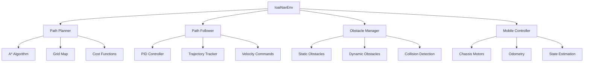

# IOAI Navigation Environment (ioai_nav_env.py)

The `IoaiNavEnv` class provides a comprehensive environment for mobile robot navigation, path planning, and obstacle avoidance. This environment is designed for autonomous navigation research, multi-robot coordination, and navigation algorithm development.

## 🎯 Core Features

- **Path Planning**: A* algorithm with dynamic obstacle handling
- **Obstacle Avoidance**: Real-time collision detection and avoidance
- **Mobile Base Control**: Omnidirectional chassis with precise positioning
- **Dynamic Environment**: Procedurally generated obstacles
- **Path Following**: PID-based trajectory tracking
- **Multi-Goal Navigation**: Sequential waypoint navigation

## 🏗️ Architecture Overview



## 🔧 Environment Setup

### Simulator Configuration

The navigation environment creates a large open space with obstacles:

```python
def _setup_simulator(self, headless):
    """Initialize navigation environment with obstacles"""
    
    # Create simulator configuration
    sim_config = PhysicsSimulatorConfig(
        mujoco_config=MujocoConfig(headless=headless)
    )
    
    self.simulator = PhysicsSimulator(sim_config)
    self.simulator.add_default_scene()
    
    # Add Galbot robot for navigation
    robot_config = RobotConfig(
        prim_path="/World/Galbot",
        name="galbot_one_charlie",  # Navigation variant
        mjcf_path=Path()
            .joinpath(self.simulator.synthnova_assets_directory)
            .joinpath("synthnova_assets")
            .joinpath("robots")
            .joinpath("galbot_one_foxtrot_description_simplified")
            .joinpath("galbot_one_foxtrot.xml"),
        position=[0, 0, 0],
        orientation=[0, 0, 0, 1]
    )
    self.simulator.add_robot(robot_config)
    
    # Generate random obstacles
    self._add_random_obstacles()
    
    self.simulator.initialize()
    self.robot = self.simulator.get_robot("/World/Galbot")
```

### Random Obstacle Generation

The environment creates procedural obstacles for navigation challenges:

```python
def _add_random_obstacles(self):
    """Generate random obstacles in the environment"""
    
    # Use planner to generate obstacle positions
    obstacle_points = self.planner.generate_obstacles(
        probability=0.3,  # 30% obstacle density
        exclusion_zones=[
            (0, 0, 2),      # Start area (x, y, radius)
            (10, 10, 2)     # Goal area
        ]
    )
    
    # Create obstacle objects
    for i, point in enumerate(obstacle_points):
        obstacle_config = CuboidConfig(
            prim_path=f"/World/Obstacle_{i}",
            name=f"obstacle_{i}",
            position=[point[0], point[1], 0.4],  # Ground level
            scale=[0.6, 0.6, 0.6],               # 60cm cubes
            color=[
                random.random(), 
                random.random(), 
                random.random()
            ]  # Random colors
        )
        self.simulator.add_object(obstacle_config)
```

### Robot Interface Configuration

The navigation interface focuses on chassis control and odometry:

```python
def _setup_interface(self):
    """Configure robot interface for navigation"""
    
    config = GalbotInterfaceConfig()
    config.robot.prim_path = "/World/Galbot"
    
    robot_name = self.robot.name
    
    # Enable necessary modules for navigation
    config.modules_manager.enabled_modules.extend([
        "right_arm", "left_arm", "leg", "head", "chassis"
    ])
    
    # Configure joint names for each module
    config.right_arm.joint_names = [
        f"{robot_name}/right_arm_joint{i}" for i in range(1, 8)
    ]
    config.left_arm.joint_names = [
        f"{robot_name}/left_arm_joint{i}" for i in range(1, 8)
    ]
    config.leg.joint_names = [
        f"{robot_name}/leg_joint{i}" for i in range(1, 5)
    ]
    config.head.joint_names = [
        f"{robot_name}/head_joint{i}" for i in range(1, 3)
    ]
    
    # Critical: Chassis configuration for navigation
    config.chassis.joint_names = [
        f"{robot_name}/mobile_forward_joint",    # Forward/backward
        f"{robot_name}/mobile_side_joint",       # Left/right strafe
        f"{robot_name}/mobile_yaw_joint",        # Rotation
    ]
    
    self.interface = GalbotInterface(
        galbot_interface_config=config, 
        simulator=self.simulator
    )
    self.interface.initialize()
```

## 🗺️ Path Planning System

### A* Algorithm Implementation

The environment uses A* for optimal path planning:

```python
class AStarPathPlanner:
    """A* path planner with dynamic obstacle handling"""
    
    def __init__(self, grid_size=1, obstacle_radius=0.5):
        self.grid_size = grid_size
        self.obstacle_radius = obstacle_radius
        self.obstacle_map = {}
    
    def find_path(self, start, goal):
        """
        Find optimal path from start to goal using A*
        
        Args:
            start: Start position (x, y)
            goal: Goal position (x, y)
            
        Returns:
            List of waypoints from start to goal
        """
        
        # Convert continuous coordinates to grid
        start_grid = self._world_to_grid(start)
        goal_grid = self._world_to_grid(goal)
        
        # Initialize A* data structures
        open_set = []
        heapq.heappush(open_set, (0, start_grid))
        
        came_from = {}
        g_score = {start_grid: 0}
        f_score = {start_grid: self._heuristic(start_grid, goal_grid)}
        
        while open_set:
            current = heapq.heappop(open_set)[1]
            
            if current == goal_grid:
                # Reconstruct path
                path = self._reconstruct_path(came_from, current)
                return [self._grid_to_world(p) for p in path]
            
            # Explore neighbors
            for neighbor in self._get_neighbors(current):
                if self._is_obstacle(neighbor):
                    continue
                
                tentative_g = g_score[current] + self._distance(current, neighbor)
                
                if neighbor not in g_score or tentative_g < g_score[neighbor]:
                    came_from[neighbor] = current
                    g_score[neighbor] = tentative_g
                    f_score[neighbor] = tentative_g + self._heuristic(neighbor, goal_grid)
                    
                    if neighbor not in [item[1] for item in open_set]:
                        heapq.heappush(open_set, (f_score[neighbor], neighbor))
        
        return []  # No path found
    
    def _heuristic(self, a, b):
        """Manhattan distance heuristic"""
        return abs(a[0] - b[0]) + abs(a[1] - b[1])
    
    def _is_obstacle(self, grid_pos):
        """Check if grid position contains obstacle"""
        world_pos = self._grid_to_world(grid_pos)
        
        for obs_pos in self.obstacle_map.values():
            distance = math.sqrt(
                (world_pos[0] - obs_pos[0])**2 + 
                (world_pos[1] - obs_pos[1])**2
            )
            if distance < self.obstacle_radius:
                return True
        
        return False
```

### Dynamic Path Re-planning

The environment supports real-time path updates:

```python
def update_path_planning(self):
    """Update path when obstacles change"""
    
    # Get current position
    current_pos, _ = self._get_current_state()
    
    # Check if current path is still valid
    if not self._is_path_clear(self.path[self.current_target_index:]):
        print("Obstacle detected! Re-planning path...")
        
        # Re-plan from current position
        self.path = self.planner.find_path(current_pos, self.goal_pos)
        self.current_target_index = 0
        
        if not self.path:
            print("No valid path found!")
            self.interface.chassis.set_joint_velocities([0.0, 0.0, 0.0])
```

## 🎮 Path Following Control

### PID-Based Path Follower

The environment implements a PID controller for smooth path following:

```python
class BasicPathFollower:
    """PID-based path following controller"""
    
    def __init__(self, velocity=0.8):
        self.max_velocity = velocity
        
        # PID gains
        self.kp_linear = 1.0
        self.ki_linear = 0.1
        self.kd_linear = 0.05
        
        self.kp_angular = 2.0
        self.ki_angular = 0.1
        self.kd_angular = 0.1
        
        # Error accumulation
        self.linear_error_integral = 0
        self.angular_error_integral = 0
        self.prev_linear_error = 0
        self.prev_angular_error = 0
    
    def calculate_control(self, current_pos, current_heading, target_pos):
        """
        Calculate control commands for path following
        
        Args:
            current_pos: Current position (x, y)
            current_heading: Current heading angle (radians)
            target_pos: Target position (x, y)
            
        Returns:
            Tuple of (forward_vel, side_vel, yaw_vel)
        """
        
        # Calculate position error
        dx = target_pos[0] - current_pos[0]
        dy = target_pos[1] - current_pos[1]
        distance_error = math.sqrt(dx*dx + dy*dy)
        
        # Calculate desired heading
        desired_heading = math.atan2(dy, dx)
        
        # Calculate angular error (handle wrap-around)
        angular_error = desired_heading - current_heading
        while angular_error > math.pi:
            angular_error -= 2 * math.pi
        while angular_error < -math.pi:
            angular_error += 2 * math.pi
        
        # PID control for linear velocity
        self.linear_error_integral += distance_error
        linear_error_derivative = distance_error - self.prev_linear_error
        
        linear_velocity = (
            self.kp_linear * distance_error +
            self.ki_linear * self.linear_error_integral +
            self.kd_linear * linear_error_derivative
        )
        
        # PID control for angular velocity
        self.angular_error_integral += angular_error
        angular_error_derivative = angular_error - self.prev_angular_error
        
        angular_velocity = (
            self.kp_angular * angular_error +
            self.ki_angular * self.angular_error_integral +
            self.kd_angular * angular_error_derivative
        )
        
        # Clamp velocities
        linear_velocity = max(-self.max_velocity, 
                            min(self.max_velocity, linear_velocity))
        angular_velocity = max(-2.0, min(2.0, angular_velocity))
        
        # Convert to robot frame velocities
        forward_vel = linear_velocity * math.cos(angular_error)
        side_vel = linear_velocity * math.sin(angular_error)
        yaw_vel = angular_velocity
        
        # Store errors for next iteration
        self.prev_linear_error = distance_error
        self.prev_angular_error = angular_error
        
        return forward_vel, side_vel, yaw_vel
```

### Waypoint Management

The environment handles waypoint progression and tolerance checking:

```python
def _update_target_index(self, current_pos):
    """Update target waypoint based on proximity"""
    
    if self.current_target_index >= len(self.path):
        return False
    
    target = self.path[self.current_target_index]
    distance = math.sqrt(
        (target[0] - current_pos[0])**2 + 
        (target[1] - current_pos[1])**2
    )
    
    # Check if waypoint reached
    if distance < self.waypoint_tolerance:
        self.current_target_index += 1
        print(f"Reached waypoint {self.current_target_index}/{len(self.path)}")
        return True
    
    return False

def _get_current_state(self):
    """Get current robot state from chassis joints"""
    
    joints = self.interface.chassis.get_joint_positions()
    
    # Extract position and orientation
    position = (joints[0], joints[1])  # (x, y)
    heading = joints[2]                # yaw angle
    
    return position, heading
```

## 🚀 Navigation Execution

### Main Navigation Loop

The core navigation callback coordinates all navigation components:

```python
def follow_path_callback(self):
    """Main navigation control loop"""
    
    # Allow initial stabilization
    if self.simulator.get_step_count() < 3000:
        return
    
    # Check if navigation completed
    if self.current_target_index >= len(self.path):
        self.interface.chassis.set_joint_velocities([0.0, 0.0, 0.0])
        self.simulator.remove_physics_callback("follow_path_callback")
        print("Navigation completed successfully!")
        return
    
    # Get current robot state
    current_pos, current_heading = self._get_current_state()
    
    # Update target waypoint if reached
    self._update_target_index(current_pos)
    
    # Get current target position
    if self.current_target_index < len(self.path):
        target_pos = self.path[self.current_target_index]
    else:
        target_pos = self.path[-1]  # Final goal
    
    # Calculate control commands
    forward_vel, side_vel, yaw_vel = self.path_follower.calculate_control(
        current_pos, current_heading, target_pos
    )
    
    # Apply velocity commands to chassis
    self.interface.chassis.set_joint_velocities([forward_vel, side_vel, yaw_vel])
    
    # Debug output every 1000 steps
    if self.simulator.get_step_count() % 1000 == 0:
        distance_to_goal = math.sqrt(
            (self.goal_pos[0] - current_pos[0])**2 + 
            (self.goal_pos[1] - current_pos[1])**2
        )
        print(f"Current: {current_pos}, Target: {target_pos}, "
              f"Distance to goal: {distance_to_goal:.2f}m")
```

### Smooth Joint Motion

For stable robot posture during navigation:

```python
def _move_joints_to_target(self, module, target_positions, steps=200):
    """Execute smooth joint motion for body posture"""
    
    current_positions = module.get_joint_positions()
    
    # Generate smooth trajectory
    positions = interpolate_joint_positions(
        current_positions, target_positions, steps
    )
    
    # Create and execute trajectory
    joint_trajectory = JointTrajectory(positions=np.array(positions))
    module.follow_trajectory(joint_trajectory)

def _init_pose(self):
    """Initialize robot to stable navigation pose"""
    
    # Define stable poses for navigation
    poses = {
        self.interface.head: [0.0, 0.0],  # Head forward
        self.interface.leg: [0.43, 1.48, 1.07, 0.0],  # Stable stance
        self.interface.left_arm: [
            -0.4654513936071508, 1.4785659313201904, -0.6235712173907869, 
            2.097979784011841, 1.3999720811843872, -0.009971064515411854, 
            1.0999830961227417
        ],
        self.interface.right_arm: [
            0.4654513936071508, -1.4785659313201904, 0.6235712173907869, 
            -2.097979784011841, -1.3999720811843872, 0.009971064515411854, 
            -1.0999830961227417
        ]
    }
    
    # Apply poses immediately
    for module, pose in poses.items():
        module.set_joint_positions(pose, immediate=True)
```

## 📊 Performance Monitoring

### Navigation Metrics

```python
def get_navigation_metrics(self):
    """Calculate navigation performance metrics"""
    
    current_pos, current_heading = self._get_current_state()
    
    # Distance to goal
    goal_distance = math.sqrt(
        (self.goal_pos[0] - current_pos[0])**2 + 
        (self.goal_pos[1] - current_pos[1])**2
    )
    
    # Path completion percentage
    total_waypoints = len(self.path)
    completed_waypoints = self.current_target_index
    completion_percent = (completed_waypoints / total_waypoints) * 100
    
    # Current velocity
    current_velocities = self.interface.chassis.get_joint_velocities()
    linear_velocity = math.sqrt(
        current_velocities[0]**2 + current_velocities[1]**2
    )
    angular_velocity = abs(current_velocities[2])
    
    return {
        "goal_distance": goal_distance,
        "completion_percent": completion_percent,
        "current_position": current_pos,
        "current_heading": current_heading,
        "linear_velocity": linear_velocity,
        "angular_velocity": angular_velocity,
        "waypoints_completed": completed_waypoints,
        "total_waypoints": total_waypoints
    }
```

### Collision Detection

```python
def check_collision_risk(self):
    """Detect potential collisions ahead"""
    
    current_pos, current_heading = self._get_current_state()
    
    # Project robot position forward
    lookahead_distance = 1.0  # 1 meter lookahead
    future_x = current_pos[0] + lookahead_distance * math.cos(current_heading)
    future_y = current_pos[1] + lookahead_distance * math.sin(current_heading)
    
    # Check for obstacles in lookahead zone
    for obstacle_pos in self.planner.obstacle_map.values():
        distance = math.sqrt(
            (future_x - obstacle_pos[0])**2 + 
            (future_y - obstacle_pos[1])**2
        )
        
        if distance < 0.8:  # 80cm safety margin
            return True, distance
    
    return False, float('inf')
```

## 🎮 Usage Examples

### Basic Navigation

```python
from examples.ioai_examples.ioai_nav_env import IoaiNavEnv

# Create navigation environment
env = IoaiNavEnv(headless=False)

# Start navigation
env.simulator.play()
env.simulator.add_physics_callback("follow_path_callback", env.follow_path_callback)

# Run simulation
env.simulator.loop()
env.simulator.close()
```

### Custom Goal Navigation

```python
# Set custom start and goal positions
env.start_pos = (0, 0)
env.goal_pos = (15, 15)  # 15m x 15m goal

# Recompute path
env.path = env.planner.find_path(env.start_pos, env.goal_pos)
env.current_target_index = 0

print(f"New path computed with {len(env.path)} waypoints")

# Start navigation
env.simulator.add_physics_callback("follow_path_callback", env.follow_path_callback)
```

### Multi-Goal Navigation

```python
def multi_goal_navigation():
    """Navigate through multiple sequential goals"""
    
    goals = [(5, 5), (10, 5), (10, 10), (5, 10), (0, 0)]  # Square pattern
    
    for i, goal in enumerate(goals):
        print(f"Navigating to goal {i+1}: {goal}")
        
        # Get current position
        current_pos, _ = env._get_current_state()
        
        # Plan path to next goal
        path = env.planner.find_path(current_pos, goal)
        
        if path:
            env.path = path
            env.goal_pos = goal
            env.current_target_index = 0
            
            # Wait for navigation to complete
            while env.current_target_index < len(env.path):
                env.simulator.step()
            
            print(f"Reached goal {i+1}")
        else:
            print(f"No path found to goal {i+1}")
            break

# Execute multi-goal navigation
env.simulator.add_physics_callback("multi_goal", multi_goal_navigation)
```

### Dynamic Obstacle Avoidance

```python
def dynamic_obstacle_callback():
    """Handle dynamic obstacles during navigation"""
    
    # Check for collision risk
    collision_risk, distance = env.check_collision_risk()
    
    if collision_risk:
        print(f"Collision risk detected! Distance: {distance:.2f}m")
        
        # Stop and replan
        env.interface.chassis.set_joint_velocities([0.0, 0.0, 0.0])
        
        # Get current position and replan
        current_pos, _ = env._get_current_state()
        new_path = env.planner.find_path(current_pos, env.goal_pos)
        
        if new_path:
            env.path = new_path
            env.current_target_index = 0
            print("New path computed to avoid obstacle")
        else:
            print("No alternative path found!")

# Add dynamic obstacle handling
env.simulator.add_physics_callback("obstacle_avoidance", dynamic_obstacle_callback)
```

## 🧮 Mathematical Foundations

### Kinematic Model

For an omnidirectional robot, the kinematic model is:

$$\begin{bmatrix} \dot{x} \\ \dot{y} \\ \dot{\theta} \end{bmatrix} = \begin{bmatrix} \cos\theta & -\sin\theta & 0 \\ \sin\theta & \cos\theta & 0 \\ 0 & 0 & 1 \end{bmatrix} \begin{bmatrix} v_x \\ v_y \\ \omega \end{bmatrix}$$

Where:
- $(x, y, \theta)$ is the robot pose
- $(v_x, v_y, ω)$ are the control velocities

### A* Cost Function

The A* algorithm uses the cost function:

$$f(n) = g(n) + h(n)$$

Where:
- $g(n)$ is the cost from start to node $n$
- $h(n)$ is the heuristic cost from $n$ to goal
- $f(n)$ is the total estimated cost

### PID Control Law

The PID controller implements:

$$u(t) = K_p e(t) + K_i \int_0^t e(\tau) d\tau + K_d \frac{de(t)}{dt}$$

Where:
- $e(t)$ is the error signal
- $K_p, K_i, K_d$ are the PID gains
- $u(t)$ is the control output

## 📚 References

- [A* Search Algorithm](https://en.wikipedia.org/wiki/A*_search_algorithm)
- [Mobile Robot Navigation](https://link.springer.com/book/10.1007/978-3-030-18493-7)
- [PID Control Theory](https://ieeexplore.ieee.org/document/8550661)
- [Path Planning Algorithms](https://journals.sagepub.com/doi/10.1177/1729881420962945)

---

**Next**: [Test Environment →](IOAI%20Test%20Environment.md)
