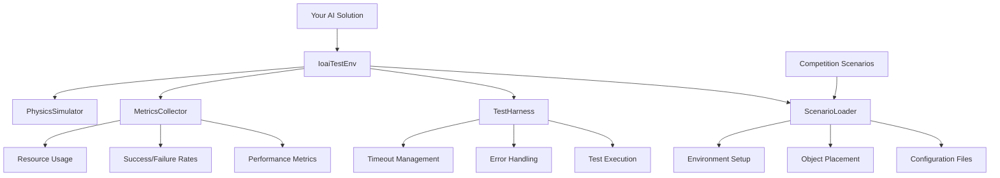

# IOAI Test Environment (IoaiTestEnv)

**🧪 Competition Testing and Scenario Framework**

The IoaiTestEnv provides a comprehensive testing framework for IOAI competition scenarios. It allows teams to load, configure, and test their solutions in standardized competition environments with realistic constraints and evaluation metrics.

## 🎯 Competition Use Cases

- **Scenario Testing**: Load and test official competition scenarios
- **Performance Benchmarking**: Measure execution time, success rates, and resource usage
- **Algorithm Validation**: Verify solution robustness across different test cases
- **Team Collaboration**: Standardized testing framework for team development

## 🏗️ Architecture Overview



## 📋 Core Features

### Scenario Management
- **Config-Based Loading**: YAML/JSON scenario configurations
- **Object Placement**: Automated placement of test objects
- **Environment Variation**: Randomized testing conditions
- **Reproducible Results**: Seed-based deterministic testing

### Testing Framework
- **Automated Execution**: Batch testing of multiple scenarios
- **Performance Metrics**: Timing, memory, success rate tracking
- **Error Reporting**: Detailed failure analysis and debugging
- **Competition Compliance**: Official IOAI testing standards

## 🚀 Quick Start for Competition Testing

### Basic Test Environment Setup

```python
from examples.ioai_examples.ioai_test_env import IoaiTestEnv
import json

# Create test environment
test_env = IoaiTestEnv(headless=True)  # Faster for batch testing

# Define your competition solution
def your_competition_solution():
    """
    Your AI algorithm to be tested
    This will be executed in each test scenario
    """
    try:
        # Example: Access the test scenario configuration
        scenario_config = test_env.current_scenario
        
        # Your algorithm implementation
        if scenario_config["task_type"] == "manipulation":
            # Handle manipulation task
            success = execute_manipulation_task()
        elif scenario_config["task_type"] == "navigation":
            # Handle navigation task
            success = execute_navigation_task()
        else:
            # Handle other task types
            success = execute_generic_task()
        
        return success
        
    except Exception as e:
        print(f"Solution failed: {e}")
        return False

def execute_manipulation_task():
    """Example manipulation task implementation"""
    # Your manipulation algorithm here
    print("Executing manipulation task...")
    # Placeholder - replace with actual implementation
    return True

def execute_navigation_task():
    """Example navigation task implementation"""
    # Your navigation algorithm here
    print("Executing navigation task...")
    # Placeholder - replace with actual implementation
    return True

def execute_generic_task():
    """Example generic task implementation"""
    # Your generic algorithm here
    print("Executing generic task...")
    # Placeholder - replace with actual implementation
    return True

# Register your solution for testing
test_env.register_solution("team_solution", your_competition_solution)

# Run test suite
test_results = test_env.run_test_suite()

# Print results
print(f"📊 Test Results: {test_results['success_rate']:.1%} success rate")
print(f"⏱️  Average execution time: {test_results['avg_time']:.2f}s")
```

### Competition Scenario Configuration

```python
# Create a competition scenario configuration
competition_scenario = {
    "scenario_id": "ioai_2025_manipulation_01",
    "task_type": "manipulation",
    "description": "Pick and place colored cubes in specific order",
    "time_limit": 60.0,  # seconds
    "success_criteria": {
        "objects_placed": 3,
        "position_tolerance": 0.05,  # meters
        "orientation_tolerance": 0.1  # radians
    },
    "objects": [
        {
            "type": "cube",
            "color": "red",
            "size": [0.05, 0.05, 0.05],
            "position": [0.5, 0.2, 0.1],
            "orientation": [0, 0, 0, 1]
        },
        {
            "type": "cube", 
            "color": "blue",
            "size": [0.05, 0.05, 0.05],
            "position": [0.5, 0.0, 0.1],
            "orientation": [0, 0, 0, 1]
        },
        {
            "type": "cube",
            "color": "green", 
            "size": [0.05, 0.05, 0.05],
            "position": [0.5, -0.2, 0.1],
            "orientation": [0, 0, 0, 1]
        }
    ],
    "target_locations": [
        {"position": [1.0, 0.2, 0.1], "color": "red"},
        {"position": [1.0, 0.0, 0.1], "color": "blue"},
        {"position": [1.0, -0.2, 0.1], "color": "green"}
    ],
    "environment": {
        "lighting": "standard",
        "noise_level": 0.0,
        "distractor_objects": 0
    }
}

# Load and run specific scenario
test_env.load_scenario(competition_scenario)
result = test_env.run_single_test("team_solution")
print(f"Scenario result: {'✅ PASS' if result['success'] else '❌ FAIL'}")
```

### Advanced Testing Framework

```python
class CompetitionTestSuite:
    """Advanced testing framework for IOAI competition preparation"""
    
    def __init__(self):
        self.test_env = IoaiTestEnv(headless=True)
        self.test_results = []
        self.performance_metrics = {
            "total_tests": 0,
            "passed_tests": 0,
            "failed_tests": 0,
            "average_time": 0.0,
            "memory_usage": [],
            "error_analysis": {}
        }
    
    def load_competition_scenarios(self, scenario_file):
        """Load official competition scenarios from file"""
        with open(scenario_file, 'r') as f:
            scenarios = json.load(f)
        
        print(f"📋 Loaded {len(scenarios)} competition scenarios")
        return scenarios
    
    def run_comprehensive_test(self, solution_callback, scenarios):
        """Run comprehensive testing across all scenarios"""
        print("🏆 Starting IOAI Competition Test Suite")
        print("=" * 50)
        
        for i, scenario in enumerate(scenarios):
            print(f"\n🎯 Test {i+1}/{len(scenarios)}: {scenario['scenario_id']}")
            
            # Run individual test
            result = self.run_scenario_test(solution_callback, scenario)
            self.test_results.append(result)
            
            # Update metrics
            self.update_performance_metrics(result)
            
            # Print immediate feedback
            status = "✅ PASS" if result['success'] else "❌ FAIL"
            print(f"{status} - {result['execution_time']:.2f}s")
            
            if not result['success']:
                print(f"   Error: {result.get('error', 'Unknown failure')}")
        
        # Generate final report
        self.generate_competition_report()
        return self.test_results
    
    def run_scenario_test(self, solution_callback, scenario):
        """Run a single scenario test with full metrics collection"""
        import time
        import psutil
        import os
        
        # Setup scenario
        self.test_env.load_scenario(scenario)
        
        # Performance tracking
        start_time = time.time()
        start_memory = psutil.Process(os.getpid()).memory_info().rss / 1024 / 1024
        
        try:
            # Execute solution with timeout
            success = self.execute_with_timeout(
                solution_callback, scenario.get('time_limit', 60.0)
            )
            
            execution_time = time.time() - start_time
            end_memory = psutil.Process(os.getpid()).memory_info().rss / 1024 / 1024
            memory_used = end_memory - start_memory
            
            # Validate results against success criteria
            if success:
                success = self.validate_success_criteria(scenario)
            
            return {
                "scenario_id": scenario['scenario_id'],
                "success": success,
                "execution_time": execution_time,
                "memory_used": memory_used,
                "within_time_limit": execution_time <= scenario.get('time_limit', 60.0),
                "error": None
            }
            
        except Exception as e:
            execution_time = time.time() - start_time
            return {
                "scenario_id": scenario['scenario_id'],
                "success": False,
                "execution_time": execution_time,
                "memory_used": 0,
                "within_time_limit": False,
                "error": str(e)
            }
    
    def execute_with_timeout(self, callback, timeout):
        """Execute callback with timeout protection"""
        import signal
        
        def timeout_handler(signum, frame):
            raise TimeoutError(f"Solution exceeded time limit of {timeout}s")
        
        # Set timeout
        signal.signal(signal.SIGALRM, timeout_handler)
        signal.alarm(int(timeout))
        
        try:
            success = callback()
            signal.alarm(0)  # Cancel timeout
            return success
        except TimeoutError:
            signal.alarm(0)  # Cancel timeout
            raise
    
    def validate_success_criteria(self, scenario):
        """Validate solution meets scenario success criteria"""
        criteria = scenario.get('success_criteria', {})
        
        # Example validation logic - customize based on your needs
        if 'objects_placed' in criteria:
            # Check if correct number of objects were placed
            placed_count = self.count_placed_objects(scenario)
            if placed_count < criteria['objects_placed']:
                return False
        
        if 'position_tolerance' in criteria:
            # Check placement accuracy
            if not self.check_placement_accuracy(scenario, criteria['position_tolerance']):
                return False
        
        return True
    
    def count_placed_objects(self, scenario):
        """Count how many objects were successfully placed"""
        # Implementation depends on your specific object tracking
        # This is a placeholder
        return len(scenario.get('target_locations', []))
    
    def check_placement_accuracy(self, scenario, tolerance):
        """Check if objects are placed within tolerance"""
        # Implementation depends on your specific position tracking
        # This is a placeholder
        return True
    
    def update_performance_metrics(self, result):
        """Update overall performance metrics"""
        self.performance_metrics['total_tests'] += 1
        
        if result['success']:
            self.performance_metrics['passed_tests'] += 1
        else:
            self.performance_metrics['failed_tests'] += 1
            
            # Track error types
            error = result.get('error', 'Unknown')
            if error not in self.performance_metrics['error_analysis']:
                self.performance_metrics['error_analysis'][error] = 0
            self.performance_metrics['error_analysis'][error] += 1
        
        # Update average execution time
        total_time = sum(r['execution_time'] for r in self.test_results)
        self.performance_metrics['average_time'] = total_time / len(self.test_results)
        
        # Track memory usage
        self.performance_metrics['memory_usage'].append(result['memory_used'])
    
    def generate_competition_report(self):
        """Generate comprehensive competition readiness report"""
        metrics = self.performance_metrics
        
        print("\n" + "=" * 60)
        print("🏆 IOAI COMPETITION READINESS REPORT")
        print("=" * 60)
        
        # Overall performance
        success_rate = metrics['passed_tests'] / metrics['total_tests'] if metrics['total_tests'] > 0 else 0
        print(f"📊 Overall Performance:")
        print(f"   Total Tests: {metrics['total_tests']}")
        print(f"   Passed: {metrics['passed_tests']}")
        print(f"   Failed: {metrics['failed_tests']}")
        print(f"   Success Rate: {success_rate:.1%}")
        
        # Timing analysis
        print(f"\n⏱️  Timing Analysis:")
        print(f"   Average Execution Time: {metrics['average_time']:.2f}s")
        
        time_violations = sum(1 for r in self.test_results if not r['within_time_limit'])
        print(f"   Time Limit Violations: {time_violations}")
        
        # Memory analysis
        if metrics['memory_usage']:
            avg_memory = sum(metrics['memory_usage']) / len(metrics['memory_usage'])
            max_memory = max(metrics['memory_usage'])
            print(f"\n💾 Memory Analysis:")
            print(f"   Average Memory Usage: {avg_memory:.1f} MB")
            print(f"   Peak Memory Usage: {max_memory:.1f} MB")
        
        # Error analysis
        if metrics['error_analysis']:
            print(f"\n❌ Error Analysis:")
            for error, count in metrics['error_analysis'].items():
                print(f"   {error}: {count} occurrences")
        
        # Competition readiness assessment
        print(f"\n🎯 Competition Readiness:")
        if success_rate >= 0.95:
            print("   🟢 EXCELLENT - Ready for competition!")
        elif success_rate >= 0.85:
            print("   🟡 GOOD - Minor improvements needed")
        elif success_rate >= 0.70:
            print("   🟠 FAIR - Significant work required")
        else:
            print("   🔴 POOR - Major overhaul needed")
        
        # Recommendations
        print(f"\n💡 Recommendations:")
        if time_violations > 0:
            print("   - Optimize algorithm performance to meet time constraints")
        if avg_memory > 256:  # Assuming 256MB limit
            print("   - Reduce memory usage for competition compliance")
        if metrics['failed_tests'] > metrics['passed_tests']:
            print("   - Focus on algorithm robustness and error handling")
        
        print("=" * 60)

# Example usage for team testing
def run_team_competition_tests():
    """Run complete competition test suite for team"""
    
    # Initialize test suite
    test_suite = CompetitionTestSuite()
    
    # Load competition scenarios
    scenarios = test_suite.load_competition_scenarios('competition_scenarios.json')
    
    # Define team solution to test
    def team_solution():
        """Team's competition solution"""
        # Import your team's solution modules
        # from your_team_solutions import manipulation_solver, navigation_solver
        
        # Get current scenario
        scenario = test_suite.test_env.current_scenario
        
        # Route to appropriate solver based on task type
        if scenario['task_type'] == 'manipulation':
            # return manipulation_solver.solve(scenario)
            return True  # Placeholder
        elif scenario['task_type'] == 'navigation':
            # return navigation_solver.solve(scenario)
            return True  # Placeholder
        else:
            return False
    
    # Run comprehensive testing
    results = test_suite.run_comprehensive_test(team_solution, scenarios)
    
    # Save detailed results
    with open('team_test_results.json', 'w') as f:
        json.dump(results, f, indent=2)
    
    print("\n📄 Detailed results saved to 'team_test_results.json'")

if __name__ == "__main__":
    run_team_competition_tests()
```

## 🧮 Mathematical Foundations

### Test Validation Metrics

```python
def compute_placement_accuracy(actual_pos, target_pos, tolerance=0.05):
    """
    Compute placement accuracy using Euclidean distance
    
    Accuracy = 1 - (distance / tolerance) if distance <= tolerance
             = 0 if distance > tolerance
    
    Args:
        actual_pos: [x, y, z] actual position
        target_pos: [x, y, z] target position  
        tolerance: Maximum acceptable distance
    
    Returns:
        float: Accuracy score between 0 and 1
    """
    import numpy as np
    
    distance = np.linalg.norm(np.array(actual_pos) - np.array(target_pos))
    
    if distance <= tolerance:
        return 1.0 - (distance / tolerance)
    else:
        return 0.0

def compute_orientation_accuracy(actual_quat, target_quat, tolerance=0.1):
    """
    Compute orientation accuracy using quaternion angular distance
    
    Angular distance = 2 * arccos(|q1 · q2|)
    
    Args:
        actual_quat: [x, y, z, w] actual quaternion
        target_quat: [x, y, z, w] target quaternion
        tolerance: Maximum acceptable angular error (radians)
    
    Returns:
        float: Accuracy score between 0 and 1
    """
    import numpy as np
    
    # Normalize quaternions
    q1 = np.array(actual_quat) / np.linalg.norm(actual_quat)
    q2 = np.array(target_quat) / np.linalg.norm(target_quat)
    
    # Compute angular distance
    dot_product = np.abs(np.dot(q1, q2))
    dot_product = min(dot_product, 1.0)  # Clamp to avoid numerical errors
    angular_distance = 2 * np.arccos(dot_product)
    
    if angular_distance <= tolerance:
        return 1.0 - (angular_distance / tolerance)
    else:
        return 0.0

def compute_overall_score(position_scores, orientation_scores, weights=None):
    """
    Compute overall scenario score from individual metrics
    
    Score = Σ(w_i * score_i) / Σ(w_i)
    
    Args:
        position_scores: List of position accuracy scores
        orientation_scores: List of orientation accuracy scores
        weights: Optional weights for each score
    
    Returns:
        float: Overall score between 0 and 1
    """
    import numpy as np
    
    all_scores = position_scores + orientation_scores
    
    if weights is None:
        weights = [1.0] * len(all_scores)
    
    weighted_sum = sum(w * s for w, s in zip(weights, all_scores))
    weight_sum = sum(weights)
    
    return weighted_sum / weight_sum if weight_sum > 0 else 0.0
```

### Performance Analysis

```python
def analyze_execution_performance(test_results):
    """
    Analyze execution performance across test scenarios
    
    Returns statistical analysis of timing, memory, and success patterns
    """
    import numpy as np
    from collections import defaultdict
    
    # Extract performance data
    execution_times = [r['execution_time'] for r in test_results]
    memory_usage = [r['memory_used'] for r in test_results]
    success_by_type = defaultdict(list)
    
    for result in test_results:
        scenario_type = result.get('task_type', 'unknown')
        success_by_type[scenario_type].append(result['success'])
    
    # Statistical analysis
    analysis = {
        'timing': {
            'mean': np.mean(execution_times),
            'std': np.std(execution_times),
            'min': np.min(execution_times),
            'max': np.max(execution_times),
            'percentiles': {
                '50': np.percentile(execution_times, 50),
                '95': np.percentile(execution_times, 95),
                '99': np.percentile(execution_times, 99)
            }
        },
        'memory': {
            'mean': np.mean(memory_usage),
            'std': np.std(memory_usage),
            'peak': np.max(memory_usage)
        },
        'success_by_type': {
            task_type: {
                'count': len(successes),
                'success_rate': sum(successes) / len(successes) if successes else 0,
                'failure_rate': 1 - (sum(successes) / len(successes)) if successes else 1
            }
            for task_type, successes in success_by_type.items()
        }
    }
    
    return analysis

def predict_competition_performance(test_results, competition_constraints):
    """
    Predict competition performance based on test results
    
    Uses statistical models to estimate competition success probability
    """
    analysis = analyze_execution_performance(test_results)
    
    # Time constraint compliance probability
    time_limit = competition_constraints.get('time_limit', 60.0)
    time_compliance_prob = sum(
        1 for r in test_results if r['execution_time'] <= time_limit
    ) / len(test_results)
    
    # Memory constraint compliance
    memory_limit = competition_constraints.get('memory_limit', 512)  # MB
    memory_compliance_prob = sum(
        1 for r in test_results if r['memory_used'] <= memory_limit
    ) / len(test_results)
    
    # Overall success probability
    success_prob = sum(r['success'] for r in test_results) / len(test_results)
    
    # Combined competition readiness score
    readiness_score = (
        0.4 * success_prob +
        0.3 * time_compliance_prob +
        0.2 * memory_compliance_prob +
        0.1 * min(1.0, len(test_results) / 50)  # Test coverage bonus
    )
    
    return {
        'readiness_score': readiness_score,
        'success_probability': success_prob,
        'time_compliance': time_compliance_prob,
        'memory_compliance': memory_compliance_prob,
        'recommendation': get_readiness_recommendation(readiness_score)
    }

def get_readiness_recommendation(score):
    """Get competition readiness recommendation based on score"""
    if score >= 0.9:
        return "🏆 Excellent - Competition ready!"
    elif score >= 0.8:
        return "👍 Good - Minor optimizations recommended"
    elif score >= 0.7:
        return "⚠️ Fair - Significant improvements needed"
    else:
        return "❌ Poor - Major work required before competition"
```

## 🎮 Competition-Ready Testing Examples

### Example 1: Official Scenario Testing

```python
# official_scenario_test.py
def test_official_scenarios():
    """Test against official IOAI competition scenarios"""
    
    test_env = IoaiTestEnv(headless=True)
    
    # Official competition scenarios (examples)
    official_scenarios = [
        {
            "scenario_id": "IOAI_2025_M1",
            "task_type": "manipulation",
            "description": "Sort colored objects by type",
            "time_limit": 45.0,
            "difficulty": "medium"
        },
        {
            "scenario_id": "IOAI_2025_N1", 
            "task_type": "navigation",
            "description": "Navigate maze with dynamic obstacles",
            "time_limit": 60.0,
            "difficulty": "hard"
        },
        # Add more scenarios...
    ]
    
    def competition_solution():
        """Your team's competition solution"""
        scenario = test_env.current_scenario
        
        print(f"🎯 Solving {scenario['scenario_id']}: {scenario['description']}")
        
        # Route to task-specific solver
        if scenario['task_type'] == 'manipulation':
            return solve_manipulation_challenge(scenario)
        elif scenario['task_type'] == 'navigation':
            return solve_navigation_challenge(scenario)
        else:
            return solve_generic_challenge(scenario)
    
    # Run official testing
    test_suite = CompetitionTestSuite()
    results = test_suite.run_comprehensive_test(competition_solution, official_scenarios)
    
    # Generate competition report
    print("\n📋 OFFICIAL SCENARIO TEST RESULTS")
    for result in results:
        status = "✅" if result['success'] else "❌"
        print(f"{status} {result['scenario_id']}: {result['execution_time']:.2f}s")

def solve_manipulation_challenge(scenario):
    """Solve manipulation-specific challenges"""
    # Your manipulation algorithm
    return True  # Placeholder

def solve_navigation_challenge(scenario):
    """Solve navigation-specific challenges"""
    # Your navigation algorithm
    return True  # Placeholder

def solve_generic_challenge(scenario):
    """Solve other challenge types"""
    # Your generic algorithm
    return True  # Placeholder

if __name__ == "__main__":
    test_official_scenarios()
```

### Example 2: Stress Testing

```python
# stress_test.py
def run_stress_tests():
    """Run stress tests to find algorithm breaking points"""
    
    test_env = IoaiTestEnv(headless=True)
    
    # Generate stress test scenarios
    stress_scenarios = []
    
    # Increasing difficulty levels
    for difficulty in range(1, 11):  # 1-10 difficulty scale
        scenario = {
            "scenario_id": f"STRESS_TEST_{difficulty:02d}",
            "task_type": "manipulation",
            "time_limit": max(30.0, 60.0 - difficulty * 3),  # Decreasing time
            "objects": generate_objects(difficulty * 2),  # More objects
            "obstacles": generate_obstacles(difficulty),   # More obstacles
            "noise_level": difficulty * 0.1,              # More noise
            "difficulty": difficulty
        }
        stress_scenarios.append(scenario)
    
    def stress_test_solution():
        """Solution designed to handle stress conditions"""
        scenario = test_env.current_scenario
        difficulty = scenario.get('difficulty', 1)
        
        # Adaptive algorithm based on difficulty
        if difficulty <= 3:
            return basic_solution(scenario)
        elif difficulty <= 7:
            return optimized_solution(scenario)
        else:
            return fallback_solution(scenario)
    
    # Run stress testing
    test_suite = CompetitionTestSuite()
    results = test_suite.run_comprehensive_test(stress_test_solution, stress_scenarios)
    
    # Analyze breaking points
    breaking_point = find_breaking_point(results)
    print(f"⚠️  Algorithm breaking point: Difficulty level {breaking_point}")

def generate_objects(count):
    """Generate test objects for stress testing"""
    import random
    
    objects = []
    for i in range(count):
        obj = {
            "type": random.choice(["cube", "sphere", "cylinder"]),
            "color": random.choice(["red", "blue", "green", "yellow"]),
            "position": [
                random.uniform(0.3, 0.7),
                random.uniform(-0.3, 0.3), 
                0.1
            ]
        }
        objects.append(obj)
    
    return objects

def generate_obstacles(count):
    """Generate obstacles for stress testing"""
    # Implementation for generating test obstacles
    return []  # Placeholder

def find_breaking_point(results):
    """Find the difficulty level where success rate drops below 50%"""
    for result in results:
        if not result['success']:
            scenario_id = result['scenario_id']
            difficulty = int(scenario_id.split('_')[-1])
            return difficulty
    
    return 10  # No breaking point found

def basic_solution(scenario):
    """Basic solution for easy scenarios"""
    return True  # Placeholder

def optimized_solution(scenario):
    """Optimized solution for medium scenarios"""
    return True  # Placeholder

def fallback_solution(scenario):
    """Fallback solution for hard scenarios"""
    return True  # Placeholder

if __name__ == "__main__":
    run_stress_tests()
```

## 🏆 Competition Best Practices

### 1. Comprehensive Testing Strategy
```python
def comprehensive_testing_strategy():
    """Implement a comprehensive testing strategy for competition"""
    
    # Phase 1: Basic functionality testing
    run_basic_functionality_tests()
    
    # Phase 2: Official scenario testing
    run_official_scenario_tests()
    
    # Phase 3: Stress testing
    run_stress_tests()
    
    # Phase 4: Integration testing
    run_integration_tests()
    
    # Phase 5: Performance optimization
    run_performance_optimization_tests()
    
    print("✅ Comprehensive testing strategy completed!")
```

### 2. Continuous Integration
```python
def setup_continuous_testing():
    """Setup continuous testing for team development"""
    
    # Run tests on every code commit
    # Generate performance reports
    # Alert team to regressions
    
    test_schedule = {
        "on_commit": ["basic_tests", "unit_tests"],
        "nightly": ["full_test_suite", "performance_benchmarks"],
        "weekly": ["stress_tests", "integration_tests"]
    }
    
    return test_schedule
```

### 3. Test Result Analysis
```python
def analyze_test_trends(historical_results):
    """Analyze test result trends over time"""
    
    # Track performance improvements
    # Identify regression patterns
    # Predict competition readiness timeline
    
    trends = {
        "success_rate_trend": calculate_success_trend(historical_results),
        "performance_trend": calculate_performance_trend(historical_results),
        "readiness_projection": project_competition_readiness(historical_results)
    }
    
    return trends
```

---

## 🎯 Next Steps for Competition Testing

1. **Create test scenarios**: Define comprehensive test cases
2. **Implement test automation**: Set up continuous testing
3. **Analyze results**: Use metrics to guide improvements
4. **Optimize performance**: Focus on time and memory constraints
5. **Validate readiness**: Ensure competition compliance

**Ready to test your IOAI competition solution thoroughly? Let's build robust, competition-winning algorithms! 🚀**

---

**📚 Related Documentation:**
- [IOAIEnv Base Environment](IOAI%20Environment.md)
- [IoaiGraspEnv Manipulation Environment](IOAI%20Grasp%20Environment.md)
- [IoaiNavEnv Navigation Environment](IOAI%20Navigation%20Environment.md)
- [Team Workflow Guide](Team%20Workflow.md)
