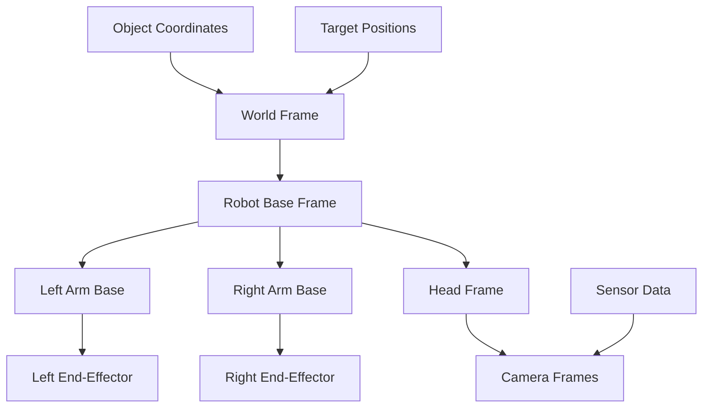

# Coordinate Transformations for IOAI Competition

**🧮 Essential 3D Mathematics for Robotics Competition**

Understanding coordinate transformations is crucial for IOAI competition success. This guide covers the mathematical foundations and practical implementations needed for precise robot control, object manipulation, and spatial reasoning.

## 🎯 Competition Applications

- **Object Manipulation**: Transform between camera, robot, and world coordinates
- **Path Planning**: Convert waypoints between different reference frames
- **Sensor Fusion**: Combine data from multiple cameras and sensors
- **Collision Avoidance**: Check spatial relationships in robot workspace

## 📐 Core Mathematical Concepts

### Coordinate Frames in IOAI



### Homogeneous Transformation Matrices

The fundamental building block for 3D transformations:

```
T = [R  t]  where R ∈ ℝ³ˣ³ (rotation matrix)
    [0  1]        t ∈ ℝ³   (translation vector)
```

## 🧮 Mathematical Foundations

### 1. Rotation Representations

#### Rotation Matrices

A 3×3 orthogonal matrix representing orientation:

```python
import numpy as np
from scipy.spatial.transform import Rotation

def rotation_matrix_x(angle):
    """Rotation about X-axis by angle (radians)"""
    c, s = np.cos(angle), np.sin(angle)
    return np.array([
        [1,  0,  0],
        [0,  c, -s],
        [0,  s,  c]
    ])

def rotation_matrix_y(angle):
    """Rotation about Y-axis by angle (radians)"""
    c, s = np.cos(angle), np.sin(angle)
    return np.array([
        [ c,  0,  s],
        [ 0,  1,  0],
        [-s,  0,  c]
    ])

def rotation_matrix_z(angle):
    """Rotation about Z-axis by angle (radians)"""
    c, s = np.cos(angle), np.sin(angle)
    return np.array([
        [c, -s,  0],
        [s,  c,  0],
        [0,  0,  1]
    ])

def euler_to_rotation_matrix(roll, pitch, yaw):
    """
    Convert Euler angles (ZYX convention) to rotation matrix
    
    R = R_z(yaw) * R_y(pitch) * R_x(roll)
    
    Args:
        roll: Rotation about X-axis (radians)
        pitch: Rotation about Y-axis (radians)  
        yaw: Rotation about Z-axis (radians)
    
    Returns:
        3x3 rotation matrix
    """
    R_x = rotation_matrix_x(roll)
    R_y = rotation_matrix_y(pitch)
    R_z = rotation_matrix_z(yaw)
    
    return R_z @ R_y @ R_x

# Example usage for competition
def competition_rotation_example():
    """Example rotation computation for competition scenarios"""
    
    # Robot gripper needs to approach object from above
    approach_angle = np.pi  # 180 degrees - gripper pointing down
    rotation_matrix = euler_to_rotation_matrix(0, approach_angle, 0)
    
    print("Gripper approach rotation matrix:")
    print(rotation_matrix)
    
    # Convert to quaternion for robot control
    rotation = Rotation.from_matrix(rotation_matrix)
    quaternion = rotation.as_quat()  # [x, y, z, w]
    
    print(f"Quaternion: [{quaternion[0]:.3f}, {quaternion[1]:.3f}, {quaternion[2]:.3f}, {quaternion[3]:.3f}]")
    
    return rotation_matrix, quaternion

if __name__ == "__main__":
    competition_rotation_example()
```

#### Quaternions

Quaternions provide a compact, singularity-free representation of rotations:

```python
def quaternion_multiply(q1, q2):
    """
    Multiply two quaternions: q1 * q2
    
    Quaternion multiplication formula:
    q1 * q2 = [w1*w2 - x1*x2 - y1*y2 - z1*z2,
               w1*x2 + x1*w2 + y1*z2 - z1*y2,
               w1*y2 - x1*z2 + y1*w2 + z1*x2,
               w1*z2 + x1*y2 - y1*x2 + z1*w2]
    
    Args:
        q1, q2: Quaternions as [x, y, z, w]
    
    Returns:
        Resulting quaternion [x, y, z, w]
    """
    x1, y1, z1, w1 = q1
    x2, y2, z2, w2 = q2
    
    return np.array([
        w1*x2 + x1*w2 + y1*z2 - z1*y2,
        w1*y2 - x1*z2 + y1*w2 + z1*x2,
        w1*z2 + x1*y2 - y1*x2 + z1*w2,
        w1*w2 - x1*x2 - y1*y2 - z1*z2
    ])

def quaternion_conjugate(q):
    """
    Compute quaternion conjugate: q* = [-x, -y, -z, w]
    Used for inverse rotation
    """
    return np.array([-q[0], -q[1], -q[2], q[3]])

def quaternion_to_rotation_matrix(q):
    """
    Convert quaternion to 3x3 rotation matrix
    
    Given quaternion q = [x, y, z, w], rotation matrix:
    R = I + 2s[q_v]× + 2[q_v]ײ
    
    where s = w, q_v = [x, y, z], and [v]× is skew-symmetric matrix
    """
    x, y, z, w = q
    
    # Normalize quaternion
    norm = np.sqrt(x*x + y*y + z*z + w*w)
    x, y, z, w = x/norm, y/norm, z/norm, w/norm
    
    # Compute rotation matrix elements
    xx, yy, zz = x*x, y*y, z*z
    xy, xz, yz = x*y, x*z, y*z
    wx, wy, wz = w*x, w*y, w*z
    
    rotation_matrix = np.array([
        [1 - 2*(yy + zz),     2*(xy - wz),     2*(xz + wy)],
        [    2*(xy + wz), 1 - 2*(xx + zz),     2*(yz - wx)],
        [    2*(xz - wy),     2*(yz + wx), 1 - 2*(xx + yy)]
    ])
    
    return rotation_matrix

def slerp(q1, q2, t):
    """
    Spherical linear interpolation between quaternions
    
    SLERP formula:
    slerp(q1, q2, t) = (sin((1-t)θ) * q1 + sin(t*θ) * q2) / sin(θ)
    
    where θ is the angle between quaternions
    
    Args:
        q1, q2: Start and end quaternions [x, y, z, w]
        t: Interpolation parameter [0, 1]
    
    Returns:
        Interpolated quaternion
    """
    # Normalize quaternions
    q1 = q1 / np.linalg.norm(q1)
    q2 = q2 / np.linalg.norm(q2)
    
    # Compute dot product
    dot = np.dot(q1, q2)
    
    # If dot product is negative, use -q2 to take shorter path
    if dot < 0.0:
        q2 = -q2
        dot = -dot
    
    # If quaternions are very close, use linear interpolation
    if dot > 0.9995:
        result = q1 + t * (q2 - q1)
        return result / np.linalg.norm(result)
    
    # Calculate angle and perform spherical interpolation
    theta_0 = np.arccos(np.abs(dot))
    sin_theta_0 = np.sin(theta_0)
    
    theta = theta_0 * t
    sin_theta = np.sin(theta)
    
    s0 = np.cos(theta) - dot * sin_theta / sin_theta_0
    s1 = sin_theta / sin_theta_0
    
    return s0 * q1 + s1 * q2

# Competition example: Smooth gripper orientation
def competition_slerp_example():
    """Example of smooth orientation interpolation for competition"""
    
    # Start orientation: gripper pointing forward
    q_start = np.array([0, 0, 0, 1])  # Identity quaternion
    
    # End orientation: gripper pointing down for grasping
    q_end = np.array([0, 0.707, 0, 0.707])  # 90° rotation about Y-axis
    
    # Generate smooth trajectory with 50 steps
    trajectory = []
    for i in range(51):
        t = i / 50.0
        q_interp = slerp(q_start, q_end, t)
        trajectory.append(q_interp)
    
    print(f"Generated {len(trajectory)} orientation waypoints")
    print(f"Start: {q_start}")
    print(f"End: {q_end}")
    print(f"Midpoint: {trajectory[25]}")
    
    return trajectory
```

### 2. Homogeneous Transformations

#### Transformation Matrix Construction

```python
def create_transformation_matrix(position, quaternion):
    """
    Create 4x4 homogeneous transformation matrix
    
    T = [R  t]
        [0  1]
    
    Args:
        position: [x, y, z] translation
        quaternion: [x, y, z, w] rotation
    
    Returns:
        4x4 transformation matrix
    """
    # Convert quaternion to rotation matrix
    rotation_matrix = quaternion_to_rotation_matrix(quaternion)
    
    # Create homogeneous transformation matrix
    transform = np.eye(4)
    transform[:3, :3] = rotation_matrix
    transform[:3, 3] = position
    
    return transform

def transform_point(point, transformation_matrix):
    """
    Transform a 3D point using homogeneous transformation
    
    p' = T * p
    
    Args:
        point: [x, y, z] 3D point
        transformation_matrix: 4x4 transformation matrix
    
    Returns:
        Transformed 3D point
    """
    # Convert to homogeneous coordinates
    homogeneous_point = np.append(point, 1.0)
    
    # Apply transformation
    transformed_homogeneous = transformation_matrix @ homogeneous_point
    
    # Convert back to 3D coordinates
    return transformed_homogeneous[:3]

def inverse_transformation(transformation_matrix):
    """
    Compute inverse of transformation matrix
    
    T⁻¹ = [R^T  -R^T*t]
          [0        1 ]
    
    Args:
        transformation_matrix: 4x4 transformation matrix
    
    Returns:
        Inverse transformation matrix
    """
    R = transformation_matrix[:3, :3]
    t = transformation_matrix[:3, 3]
    
    # Compute inverse
    R_inv = R.T  # Transpose of rotation matrix
    t_inv = -R_inv @ t
    
    # Create inverse transformation matrix
    T_inv = np.eye(4)
    T_inv[:3, :3] = R_inv
    T_inv[:3, 3] = t_inv
    
    return T_inv

def compose_transformations(*transformations):
    """
    Compose multiple transformations: T_total = T_n * ... * T_2 * T_1
    
    Args:
        *transformations: Sequence of 4x4 transformation matrices
    
    Returns:
        Composed transformation matrix
    """
    result = np.eye(4)
    
    for transform in transformations:
        result = result @ transform
    
    return result

# Competition example: Transform object from camera to robot coordinates
def competition_transformation_example():
    """Example coordinate transformation for competition"""
    
    # Object detected in camera coordinates
    object_in_camera = np.array([0.2, -0.1, 0.8])  # [x, y, z] in camera frame
    
    # Camera transformation (camera mounted on robot head)
    camera_position = np.array([0.1, 0.0, 1.5])  # Camera position relative to robot base
    camera_orientation = np.array([0, 0.259, 0, 0.966])  # Looking slightly down
    
    T_camera_to_robot = create_transformation_matrix(camera_position, camera_orientation)
    
    # Transform object coordinates to robot base frame
    object_in_robot = transform_point(object_in_camera, T_camera_to_robot)
    
    print(f"Object in camera frame: {object_in_camera}")
    print(f"Object in robot frame: {object_in_robot}")
    
    # Now we can plan robot motion to reach the object
    return object_in_robot
```

### 3. Frame Relationships in IOAI

#### Robot Kinematic Chain

```python
class IOAITransformChain:
    """Manage coordinate transformations for IOAI robot"""
    
    def __init__(self):
        # Define static transformations in robot structure
        self.transforms = {
            'world_to_base': np.eye(4),  # Robot base in world coordinates
            'base_to_left_arm': self._create_arm_base_transform('left'),
            'base_to_right_arm': self._create_arm_base_transform('right'),
            'base_to_head': self._create_head_base_transform(),
        }
        
        # Camera transformations (relative to head)
        self.camera_transforms = {
            'head_to_front_camera': self._create_camera_transform('front'),
            'left_arm_to_wrist_camera': self._create_camera_transform('left_wrist'),
            'right_arm_to_wrist_camera': self._create_camera_transform('right_wrist')
        }
    
    def _create_arm_base_transform(self, side):
        """Create transformation from robot base to arm base"""
        if side == 'left':
            position = np.array([0.0, 0.3, 0.8])  # Left shoulder position
        else:
            position = np.array([0.0, -0.3, 0.8])  # Right shoulder position
        
        orientation = np.array([0, 0, 0, 1])  # No rotation
        return create_transformation_matrix(position, orientation)
    
    def _create_head_base_transform(self):
        """Create transformation from robot base to head"""
        position = np.array([0.0, 0.0, 1.2])  # Head position
        orientation = np.array([0, 0, 0, 1])  # No rotation
        return create_transformation_matrix(position, orientation)
    
    def _create_camera_transform(self, camera_type):
        """Create camera-specific transformations"""
        if camera_type == 'front':
            position = np.array([0.1, 0.0, 0.05])  # Front-facing camera
            orientation = np.array([0, 0, 0, 1])
        elif camera_type == 'left_wrist':
            position = np.array([0.05, 0.02, 0.0])  # Left wrist camera
            orientation = np.array([0, 0, 0, 1])
        else:  # right_wrist
            position = np.array([0.05, -0.02, 0.0])  # Right wrist camera
            orientation = np.array([0, 0, 0, 1])
        
        return create_transformation_matrix(position, orientation)
    
    def world_to_camera(self, camera_name, head_joints=None, arm_joints=None):
        """
        Get transformation from world coordinates to camera coordinates
        
        Args:
            camera_name: 'front_head_camera', 'left_wrist_camera', 'right_wrist_camera'
            head_joints: [pan, tilt] joint angles if using head camera
            arm_joints: [j1, j2, ..., j7] joint angles if using wrist camera
        
        Returns:
            4x4 transformation matrix from world to camera
        """
        # Start with world to base transformation
        T_world_to_base = self.transforms['world_to_base']
        
        if camera_name == 'front_head_camera':
            # Chain: world -> base -> head -> camera
            T_base_to_head = self.transforms['base_to_head']
            
            # Add head joint transformations if provided
            if head_joints is not None:
                T_head_joints = self._compute_head_joint_transform(head_joints)
                T_base_to_head = T_base_to_head @ T_head_joints
            
            T_head_to_camera = self.camera_transforms['head_to_front_camera']
            
            T_total = T_world_to_base @ T_base_to_head @ T_head_to_camera
            
        elif camera_name in ['left_wrist_camera', 'right_wrist_camera']:
            # Chain: world -> base -> arm -> end_effector -> camera
            side = 'left' if 'left' in camera_name else 'right'
            
            T_base_to_arm = self.transforms[f'base_to_{side}_arm']
            
            # Add arm joint transformations if provided
            if arm_joints is not None:
                T_arm_joints = self._compute_arm_joint_transform(arm_joints, side)
                T_base_to_arm = T_base_to_arm @ T_arm_joints
            
            T_arm_to_camera = self.camera_transforms[f'{side}_arm_to_wrist_camera']
            
            T_total = T_world_to_base @ T_base_to_arm @ T_arm_to_camera
        
        else:
            raise ValueError(f"Unknown camera: {camera_name}")
        
        return T_total
    
    def _compute_head_joint_transform(self, joint_angles):
        """Compute transformation for head joints [pan, tilt]"""
        pan, tilt = joint_angles
        
        # Pan rotation (about Z-axis)
        T_pan = create_transformation_matrix([0, 0, 0], 
                                           [0, 0, np.sin(pan/2), np.cos(pan/2)])
        
        # Tilt rotation (about Y-axis)  
        T_tilt = create_transformation_matrix([0, 0, 0],
                                            [0, np.sin(tilt/2), 0, np.cos(tilt/2)])
        
        return T_pan @ T_tilt
    
    def _compute_arm_joint_transform(self, joint_angles, side):
        """Compute transformation for 7-DOF arm joints"""
        # This would implement forward kinematics for the 7-DOF arm
        # Using DH parameters or other kinematic model
        # For now, return identity as placeholder
        return np.eye(4)
    
    def camera_to_world(self, camera_name, head_joints=None, arm_joints=None):
        """Get transformation from camera coordinates to world coordinates"""
        T_world_to_camera = self.world_to_camera(camera_name, head_joints, arm_joints)
        return inverse_transformation(T_world_to_camera)

# Competition usage example
def competition_coordinate_transformation():
    """Example of coordinate transformation in competition scenario"""
    
    transform_chain = IOAITransformChain()
    
    # Object detected by front head camera
    object_in_camera = np.array([0.3, 0.1, 0.6])  # Object position in camera frame
    head_joints = [0.2, -0.3]  # Current head pan/tilt angles
    
    # Transform object to world coordinates
    T_camera_to_world = transform_chain.camera_to_world('front_head_camera', head_joints)
    object_in_world = transform_point(object_in_camera, T_camera_to_world)
    
    print(f"Object detected in camera: {object_in_camera}")
    print(f"Object position in world: {object_in_world}")
    
    # Now we can plan robot motion to reach this world position
    return object_in_world
```

## 🎮 Competition-Ready Examples

### Example 1: Multi-Camera Object Fusion

```python
def competition_multi_camera_fusion():
    """Fuse object detections from multiple cameras for robust perception"""
    
    transform_chain = IOAITransformChain()
    
    # Object detected by multiple cameras
    detections = [
        {
            'camera': 'front_head_camera',
            'position': np.array([0.4, 0.0, 0.5]),
            'confidence': 0.9,
            'head_joints': [0.0, -0.2]
        },
        {
            'camera': 'left_wrist_camera', 
            'position': np.array([0.1, -0.2, 0.3]),
            'confidence': 0.8,
            'arm_joints': [0.1, -0.5, 0.0, 1.2, 0.0, 0.8, 0.0]
        }
    ]
    
    # Transform all detections to world coordinates
    world_detections = []
    
    for detection in detections:
        camera = detection['camera']
        
        if 'head_joints' in detection:
            T_camera_to_world = transform_chain.camera_to_world(
                camera, head_joints=detection['head_joints']
            )
        else:
            T_camera_to_world = transform_chain.camera_to_world(
                camera, arm_joints=detection['arm_joints']
            )
        
        world_position = transform_point(detection['position'], T_camera_to_world)
        
        world_detections.append({
            'position': world_position,
            'confidence': detection['confidence'],
            'camera': camera
        })
    
    # Fuse detections using weighted average
    fused_position = fuse_detections(world_detections)
    
    print("Multi-camera object fusion:")
    for i, det in enumerate(world_detections):
        print(f"  Camera {i+1}: {det['position']:.3f} (conf: {det['confidence']:.2f})")
    print(f"  Fused: {fused_position:.3f}")
    
    return fused_position

def fuse_detections(detections):
    """Fuse multiple object detections using confidence-weighted averaging"""
    total_weight = sum(det['confidence'] for det in detections)
    
    if total_weight == 0:
        return np.array([0, 0, 0])
    
    weighted_sum = sum(det['confidence'] * det['position'] for det in detections)
    return weighted_sum / total_weight
```

### Example 2: Trajectory Planning in Multiple Frames

```python
def competition_trajectory_planning():
    """Plan robot trajectory considering multiple coordinate frames"""
    
    transform_chain = IOAITransformChain()
    
    # Define waypoints in different coordinate frames
    waypoints = [
        {
            'position': np.array([0.5, 0.2, 0.8]),  # World coordinates
            'frame': 'world',
            'description': 'Approach position'
        },
        {
            'position': np.array([0.0, 0.0, -0.1]),  # Camera coordinates
            'frame': 'front_head_camera',
            'head_joints': [0.1, -0.2],
            'description': 'Pre-grasp position (camera relative)'
        },
        {
            'position': np.array([0.8, 0.0, 0.1]),  # World coordinates
            'frame': 'world', 
            'description': 'Target placement position'
        }
    ]
    
    # Convert all waypoints to world coordinates
    world_trajectory = []
    
    for waypoint in waypoints:
        if waypoint['frame'] == 'world':
            world_position = waypoint['position']
        
        elif waypoint['frame'] == 'front_head_camera':
            # Transform from camera to world
            T_camera_to_world = transform_chain.camera_to_world(
                'front_head_camera', 
                head_joints=waypoint['head_joints']
            )
            world_position = transform_point(waypoint['position'], T_camera_to_world)
        
        else:
            # Handle other frames as needed
            world_position = waypoint['position']
        
        world_trajectory.append({
            'position': world_position,
            'description': waypoint['description']
        })
    
    print("Competition trajectory in world coordinates:")
    for i, point in enumerate(world_trajectory):
        print(f"  {i+1}. {point['description']}: {point['position']:.3f}")
    
    return world_trajectory
```

### Example 3: Precision Grasping with Frame Alignment

```python
def competition_precision_grasping():
    """Perform precision grasping using coordinate frame alignment"""
    
    transform_chain = IOAITransformChain()
    
    # Object detected and analyzed
    object_info = {
        'position': np.array([0.45, 0.1, 0.15]),  # World coordinates
        'orientation': np.array([0, 0, 0.707, 0.707]),  # Rotated 90° about Z
        'grasp_approach': np.array([0, 0, 1])  # Approach from above (in object frame)
    }
    
    # Compute grasp pose in object frame
    object_position = object_info['position']
    object_orientation = object_info['orientation']
    
    # Create object transformation matrix
    T_world_to_object = create_transformation_matrix(object_position, object_orientation) 
    T_object_to_world = inverse_transformation(T_world_to_object)
    
    # Define grasp approach in object frame
    grasp_offset_in_object = np.array([0, 0, 0.1])  # 10cm above object
    grasp_position_in_object = grasp_offset_in_object
    
    # Transform grasp position to world frame
    grasp_position_world = transform_point(grasp_position_in_object, T_object_to_world)
    
    # Grasp orientation: align gripper with object frame
    grasp_orientation_world = object_orientation
    
    print("Precision grasping computation:")
    print(f"  Object position: {object_position:.3f}")
    print(f"  Object orientation: {object_orientation:.3f}")
    print(f"  Grasp position: {grasp_position_world:.3f}")
    print(f"  Grasp orientation: {grasp_orientation_world:.3f}")
    
    return grasp_position_world, grasp_orientation_world
```

## 🔧 Optimization for Competition Performance

### Fast Transformation Computation

```python
class FastTransformComputer:
    """Optimized transformation computation for competition performance"""
    
    def __init__(self):
        # Pre-compute and cache common transformations
        self.cached_transforms = {}
        self.sin_cos_cache = {}
    
    def fast_rotation_matrix_z(self, angle):
        """Fast Z-axis rotation with caching"""
        if angle not in self.sin_cos_cache:
            self.sin_cos_cache[angle] = (np.sin(angle), np.cos(angle))
        
        s, c = self.sin_cos_cache[angle]
        return np.array([[c, -s, 0], [s, c, 0], [0, 0, 1]], dtype=np.float32)
    
    def batch_transform_points(self, points, transformation_matrix):
        """Transform multiple points efficiently using vectorized operations"""
        points = np.array(points)
        if points.ndim == 1:
            points = points.reshape(1, -1)
        
        # Add homogeneous coordinates
        ones = np.ones((points.shape[0], 1))
        homogeneous_points = np.hstack([points, ones])
        
        # Batch transformation
        transformed = (transformation_matrix @ homogeneous_points.T).T
        
        return transformed[:, :3]  # Remove homogeneous coordinate
    
    def competition_optimized_transform(self, camera_detections):
        """Optimized multi-detection transformation for competition"""
        # Group detections by camera to minimize transform computations
        detections_by_camera = {}
        for detection in camera_detections:
            camera = detection['camera']
            if camera not in detections_by_camera:
                detections_by_camera[camera] = []
            detections_by_camera[camera].append(detection['position'])
        
        # Transform all detections from each camera in batch
        world_positions = []
        for camera, positions in detections_by_camera.items():
            T_camera_to_world = self.get_cached_transform(camera)
            transformed_positions = self.batch_transform_points(positions, T_camera_to_world)
            world_positions.extend(transformed_positions)
        
        return world_positions
    
    def get_cached_transform(self, camera):
        """Get cached transformation matrix for camera"""
        if camera not in self.cached_transforms:
            # Compute and cache transformation
            # This is a simplified example
            self.cached_transforms[camera] = np.eye(4)
        
        return self.cached_transforms[camera]

# Competition usage
def optimized_competition_example():
    """Example of optimized coordinate transformations for competition"""
    
    fast_computer = FastTransformComputer()
    
    # Multiple object detections
    detections = [
        {'camera': 'front_head_camera', 'position': [0.3, 0.1, 0.5]},
        {'camera': 'front_head_camera', 'position': [0.4, -0.1, 0.6]},
        {'camera': 'left_wrist_camera', 'position': [0.1, 0.0, 0.2]},
        {'camera': 'left_wrist_camera', 'position': [0.15, 0.05, 0.25]}
    ]
    
    # Fast batch transformation
    import time
    start_time = time.time()
    
    world_positions = fast_computer.competition_optimized_transform(detections)
    
    computation_time = time.time() - start_time
    print(f"Transformed {len(detections)} detections in {computation_time*1000:.2f}ms")
    
    for i, pos in enumerate(world_positions):
        print(f"  Detection {i+1}: {pos}")
    
    return world_positions
```

## 🏆 Competition Best Practices

### 1. Precompute Common Transformations
```python
# Precompute static transformations during initialization
STATIC_TRANSFORMS = {
    'base_to_left_arm': create_transformation_matrix([0, 0.3, 0.8], [0, 0, 0, 1]),
    'base_to_right_arm': create_transformation_matrix([0, -0.3, 0.8], [0, 0, 0, 1]),
    # ... other static transforms
}
```

### 2. Use Efficient Data Structures
```python
# Use numpy arrays with appropriate dtypes
transform_matrix = np.array(matrix, dtype=np.float32)  # 32-bit for speed

# Vectorize operations when possible
positions = np.array(position_list)
transformed = transform_matrix[:3, :3] @ positions.T + transform_matrix[:3, 3:4]
```

### 3. Cache Expensive Computations
```python
from functools import lru_cache

@lru_cache(maxsize=128)
def cached_euler_to_quaternion(roll, pitch, yaw):
    """Cache expensive trigonometric computations"""
    return euler_to_quaternion(roll, pitch, yaw)
```

### 4. Validate Transformations
```python
def validate_transformation_matrix(T):
    """Validate transformation matrix properties"""
    # Check if rotation part is orthogonal
    R = T[:3, :3]
    should_be_identity = R @ R.T
    
    if not np.allclose(should_be_identity, np.eye(3), atol=1e-6):
        raise ValueError("Invalid rotation matrix")
    
    # Check determinant is 1 (proper rotation)
    if not np.isclose(np.linalg.det(R), 1.0, atol=1e-6):
        raise ValueError("Rotation matrix determinant is not 1")
    
    return True
```

---

## 🎯 Next Steps for Competition

1. **Practice coordinate frame problems**: Work through transformation examples
2. **Implement efficient transforms**: Optimize for competition performance  
3. **Test with real scenarios**: Validate with actual robot poses
4. **Build transformation library**: Create reusable competition utilities
5. **Master quaternion operations**: Essential for smooth robot control

**Master these coordinate transformations and your team will have precise, reliable robot control for IOAI competition success! 🎯**

---

**📚 Related Documentation:**
- [Robot Kinematics](kinematics.md)
- [Path Planning Mathematics](./path_planning.md)  
- [Vision Processing](./vision_processing.md)
- [IOAI Base Environment](IOAI%20Environment.md)
