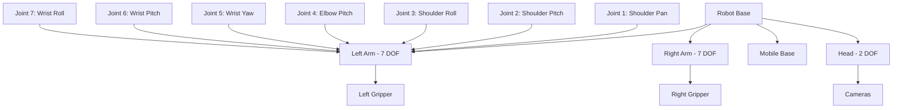

# Robot Kinematics for IOAI Competition

**🦾 Mathematical Foundations for Precise Robot Control**

Robot kinematics is the study of motion without considering forces. For IOAI competition success, understanding forward kinematics, inverse kinematics, and differential kinematics is essential for precise manipulation and movement control.

## 🎯 Competition Applications

- **Precise Manipulation**: Position end-effector exactly where needed
- **Collision Avoidance**: Compute arm configurations that avoid obstacles  
- **Trajectory Planning**: Generate smooth, feasible robot motions
- **Multi-Arm Coordination**: Synchronize dual-arm movements

## 🦾 IOAI Robot Configuration

### Galbot Robot Specifications



### Degrees of Freedom (DOF)
- **Left Arm**: 7 DOF (redundant for singularity avoidance)
- **Right Arm**: 7 DOF (independent control)
- **Head**: 2 DOF (pan and tilt)
- **Mobile Base**: 3 DOF (x, y, θ)
- **Total**: 19 DOF robot system

## 🧮 Mathematical Foundations

### 1. Forward Kinematics

Forward kinematics computes end-effector pose from joint angles:

**T_end = T_0 × T_1 × T_2 × ... × T_n**

#### Denavit-Hartenberg (DH) Parameters

Standard representation for robot link relationships:

| Joint | a_i | α_i | d_i | θ_i |
|-------|-----|-----|-----|-----|
| 1 | 0 | π/2 | 0.333 | θ₁ |
| 2 | 0 | -π/2 | 0 | θ₂ |
| 3 | 0 | π/2 | 0.316 | θ₃ |
| 4 | 0.082 | -π/2 | 0 | θ₄ |
| 5 | 0 | π/2 | 0.384 | θ₅ |
| 6 | 0 | -π/2 | 0 | θ₆ |
| 7 | 0.088 | 0 | 0.107 | θ₇ |

```python
import numpy as np
from scipy.spatial.transform import Rotation

class IOAIKinematics:
    """Forward and inverse kinematics for IOAI robot arms"""
    
    def __init__(self):
        # DH parameters for 7-DOF arm [a, α, d, θ_offset]
        self.dh_params = np.array([
            [0.0,    np.pi/2,  0.333, 0.0],  # Joint 1: Shoulder pan
            [0.0,   -np.pi/2,  0.0,   0.0],  # Joint 2: Shoulder pitch
            [0.0,    np.pi/2,  0.316, 0.0],  # Joint 3: Shoulder roll  
            [0.082, -np.pi/2,  0.0,   0.0],  # Joint 4: Elbow pitch
            [0.0,    np.pi/2,  0.384, 0.0],  # Joint 5: Wrist yaw
            [0.0,   -np.pi/2,  0.0,   0.0],  # Joint 6: Wrist pitch
            [0.088,  0.0,      0.107, 0.0],  # Joint 7: Wrist roll
        ])
        
        # Joint limits [min, max] in radians
        self.joint_limits = np.array([
            [-2.8973, 2.8973],  # Joint 1
            [-1.7628, 1.7628],  # Joint 2
            [-2.8973, 2.8973],  # Joint 3
            [-3.0718, -0.0698], # Joint 4
            [-2.8973, 2.8973],  # Joint 5
            [-0.0175, 3.7525],  # Joint 6
            [-2.8973, 2.8973],  # Joint 7
        ])
    
    def dh_transform(self, a, alpha, d, theta):
        """
        Compute DH transformation matrix for a single joint
        
        T_i = Rot_z(θ) * Trans_z(d) * Trans_x(a) * Rot_x(α)
        
        Args:
            a: Link length
            alpha: Link twist  
            d: Link offset
            theta: Joint angle
        
        Returns:
            4x4 transformation matrix
        """
        ct, st = np.cos(theta), np.sin(theta)
        ca, sa = np.cos(alpha), np.sin(alpha)
        
        return np.array([
            [ct,    -st*ca,  st*sa,   a*ct],
            [st,     ct*ca, -ct*sa,   a*st],
            [0,      sa,     ca,      d   ],
            [0,      0,      0,       1   ]
        ])
    
    def forward_kinematics(self, joint_angles):
        """
        Compute forward kinematics for 7-DOF arm
        
        Args:
            joint_angles: List/array of 7 joint angles in radians
        
        Returns:
            dict: {
                'position': [x, y, z] end-effector position,
                'orientation': [x, y, z, w] quaternion orientation,
                'transformation_matrix': 4x4 homogeneous transform,
                'joint_transforms': List of individual joint transforms
            }
        """
        if len(joint_angles) != 7:
            raise ValueError("Expected 7 joint angles for 7-DOF arm")
        
        # Initialize transformation as identity
        T_total = np.eye(4)
        joint_transforms = []
        
        # Compute transformation for each joint
        for i, (a, alpha, d, theta_offset) in enumerate(self.dh_params):
            theta = joint_angles[i] + theta_offset
            
            # Individual joint transformation
            T_i = self.dh_transform(a, alpha, d, theta)
            joint_transforms.append(T_i.copy())
            
            # Chain transformations
            T_total = T_total @ T_i
        
        # Extract position and orientation
        position = T_total[:3, 3]
        rotation_matrix = T_total[:3, :3]
        
        # Convert rotation matrix to quaternion
        rotation = Rotation.from_matrix(rotation_matrix)
        quaternion = rotation.as_quat()  # [x, y, z, w]
        
        return {
            'position': position,
            'orientation': quaternion, 
            'transformation_matrix': T_total,
            'joint_transforms': joint_transforms
        }
    
    def compute_jacobian(self, joint_angles):
        """
        Compute geometric Jacobian matrix J(q) for velocity control
        
        The Jacobian relates joint velocities to end-effector velocity:
        v_end = J(q) * q̇
        
        where v_end = [v_x, v_y, v_z, ω_x, ω_y, ω_z]^T (6x1)
              q̇ = [θ̇₁, θ̇₂, ..., θ̇₇]^T (7x1)
              J(q) = 6x7 Jacobian matrix
        
        Args:
            joint_angles: 7 joint angles in radians
        
        Returns:
            6x7 Jacobian matrix
        """
        fk_result = self.forward_kinematics(joint_angles)
        joint_transforms = fk_result['joint_transforms']
        
        # End-effector position
        p_end = fk_result['position']
        
        # Initialize Jacobian
        jacobian = np.zeros((6, 7))
        
        # Compute cumulative transformations
        T_cumulative = np.eye(4)
        
        for i in range(7):
            # Position and z-axis of joint i
            if i == 0:
                p_i = np.array([0, 0, 0])  # Base position
                z_i = np.array([0, 0, 1])  # Base z-axis
            else:
                p_i = T_cumulative[:3, 3]
                z_i = T_cumulative[:3, 2]
            
            # Update cumulative transformation
            T_cumulative = T_cumulative @ joint_transforms[i]
            
            # Compute Jacobian columns for revolute joint
            # Linear velocity: J_v = z_i × (p_end - p_i)
            jacobian[:3, i] = np.cross(z_i, p_end - p_i)
            
            # Angular velocity: J_ω = z_i
            jacobian[3:, i] = z_i
        
        return jacobian
    
    def check_joint_limits(self, joint_angles):
        """Check if joint angles are within limits"""
        joint_angles = np.array(joint_angles)
        
        violations = []
        for i, (angle, (min_limit, max_limit)) in enumerate(zip(joint_angles, self.joint_limits)):
            if angle < min_limit or angle > max_limit:
                violations.append({
                    'joint': i,
                    'angle': angle,
                    'limits': (min_limit, max_limit)
                })
        
        return len(violations) == 0, violations

# Competition example: Forward kinematics demonstration
def competition_forward_kinematics_demo():
    """Demonstrate forward kinematics for competition scenarios"""
    
    kinematics = IOAIKinematics()
    
    # Example joint configurations for competition
    test_configurations = {
        'home': [0.0, 0.0, 0.0, 0.0, 0.0, 0.0, 0.0],
        'ready': [0.0, -0.7, 0.0, 1.4, 0.0, 0.7, 0.0],
        'reach_forward': [0.0, 0.2, 0.0, 1.0, 0.0, 1.2, 0.0],
        'reach_side': [1.0, 0.0, 0.0, 1.0, 0.0, 1.0, 0.0]
    }
    
    print("🤖 Forward Kinematics Competition Examples")
    print("=" * 50)
    
    for config_name, joint_angles in test_configurations.items():
        # Check joint limits
        valid, violations = kinematics.check_joint_limits(joint_angles)
        
        if not valid:
            print(f"❌ {config_name}: Joint limit violations!")
            continue
        
        # Compute forward kinematics
        fk_result = kinematics.forward_kinematics(joint_angles)
        
        position = fk_result['position']
        orientation = fk_result['orientation']
        
        print(f"\n✅ {config_name.upper()}:")
        print(f"   Position: [{position[0]:.3f}, {position[1]:.3f}, {position[2]:.3f}]")
        print(f"   Orientation: [{orientation[0]:.3f}, {orientation[1]:.3f}, {orientation[2]:.3f}, {orientation[3]:.3f}]")
        
        # Compute reachability metrics
        reach_distance = np.linalg.norm(position)
        print(f"   Reach distance: {reach_distance:.3f}m")
    
    return test_configurations

if __name__ == "__main__":
    competition_forward_kinematics_demo()
```

### 2. Inverse Kinematics

Inverse kinematics solves for joint angles given desired end-effector pose:

**q = IK(T_desired)**

#### Analytical vs. Numerical Solutions

```python
class IOAIInverseKinematics:
    """Inverse kinematics solver for IOAI competition"""
    
    def __init__(self):
        self.kinematics = IOAIKinematics()
        self.max_iterations = 100
        self.tolerance = 1e-6
        
    def numerical_ik(self, target_position, target_orientation, initial_guess=None):
        """
        Numerical inverse kinematics using Newton-Raphson method
        
        Solves: f(q) = T_fk(q) - T_target = 0
        Using: q_{k+1} = q_k - J^†(q_k) * f(q_k)
        
        Args:
            target_position: [x, y, z] target position
            target_orientation: [x, y, z, w] target quaternion
            initial_guess: Initial joint angles (if None, use zero configuration)
        
        Returns:
            dict: {
                'success': bool,
                'joint_angles': solution joint angles,
                'iterations': number of iterations,
                'final_error': final pose error
            }
        """
        # Initial guess
        if initial_guess is None:
            q = np.zeros(7)
        else:
            q = np.array(initial_guess)
        
        target_pose = np.concatenate([target_position, target_orientation])
        
        for iteration in range(self.max_iterations):
            # Compute current end-effector pose
            fk_result = self.kinematics.forward_kinematics(q)
            current_position = fk_result['position']
            current_orientation = fk_result['orientation']
            current_pose = np.concatenate([current_position, current_orientation])
            
            # Compute pose error
            position_error = target_position - current_position
            orientation_error = self.quaternion_error(target_orientation, current_orientation)
            pose_error = np.concatenate([position_error, orientation_error])
            
            # Check convergence
            error_magnitude = np.linalg.norm(pose_error)
            if error_magnitude < self.tolerance:
                return {
                    'success': True,
                    'joint_angles': q,
                    'iterations': iteration + 1,
                    'final_error': error_magnitude
                }
            
            # Compute Jacobian
            jacobian = self.kinematics.compute_jacobian(q)
            
            # Pseudo-inverse for overdetermined system (7 DOF -> 6 DOF task)
            jacobian_pinv = np.linalg.pinv(jacobian)
            
            # Newton-Raphson update
            delta_q = jacobian_pinv @ pose_error
            q = q + delta_q
            
            # Enforce joint limits
            q = self.enforce_joint_limits(q)
        
        # Failed to converge
        return {
            'success': False,
            'joint_angles': q,
            'iterations': self.max_iterations,
            'final_error': error_magnitude
        }
    
    def quaternion_error(self, q_target, q_current):
        """
        Compute quaternion error for IK
        
        Error is computed in SO(3) space using:
        e = log(q_target * q_current^(-1))
        
        Args:
            q_target: Target quaternion [x, y, z, w]
            q_current: Current quaternion [x, y, z, w]
        
        Returns:
            3D angular error vector
        """
        # Normalize quaternions
        q_target = q_target / np.linalg.norm(q_target)
        q_current = q_current / np.linalg.norm(q_current)
        
        # Compute quaternion difference
        q_current_inv = np.array([-q_current[0], -q_current[1], -q_current[2], q_current[3]])
        q_error = self.quaternion_multiply(q_target, q_current_inv)
        
        # Convert to angular error (simplified)
        # For small angles: e ≈ 2 * [x, y, z] components
        angular_error = 2.0 * q_error[:3]
        
        return angular_error
    
    def quaternion_multiply(self, q1, q2):
        """Multiply two quaternions"""
        x1, y1, z1, w1 = q1
        x2, y2, z2, w2 = q2
        
        return np.array([
            w1*x2 + x1*w2 + y1*z2 - z1*y2,
            w1*y2 - x1*z2 + y1*w2 + z1*x2,
            w1*z2 + x1*y2 - y1*x2 + z1*w2,
            w1*w2 - x1*x2 - y1*y2 - z1*z2
        ])
    
    def enforce_joint_limits(self, joint_angles):
        """Clamp joint angles to limits"""
        joint_angles = np.array(joint_angles)
        limits = self.kinematics.joint_limits
        
        for i in range(len(joint_angles)):
            joint_angles[i] = np.clip(joint_angles[i], limits[i, 0], limits[i, 1])
        
        return joint_angles
    
    def competition_ik_with_obstacles(self, target_position, target_orientation, 
                                    obstacle_positions=None, min_distance=0.1):
        """
        IK solver with obstacle avoidance for competition
        
        Uses potential field method to avoid obstacles while reaching target
        
        Args:
            target_position: Target end-effector position
            target_orientation: Target end-effector orientation
            obstacle_positions: List of obstacle positions
            min_distance: Minimum distance to maintain from obstacles
        
        Returns:
            IK solution with obstacle avoidance
        """
        if obstacle_positions is None:
            # No obstacles - use standard IK
            return self.numerical_ik(target_position, target_orientation)
        
        # Initial guess - try multiple starting configurations
        initial_guesses = [
            np.zeros(7),  # Home position
            np.array([0, -0.7, 0, 1.4, 0, 0.7, 0]),  # Ready position
            np.random.uniform(-1, 1, 7),  # Random configuration
        ]
        
        best_solution = None
        min_obstacle_distance = 0
        
        for initial_guess in initial_guesses:
            solution = self.numerical_ik(target_position, target_orientation, initial_guess)
            
            if solution['success']:
                # Check obstacle clearance
                clearance = self.check_obstacle_clearance(
                    solution['joint_angles'], obstacle_positions, min_distance
                )
                
                if clearance['valid'] and clearance['min_distance'] > min_obstacle_distance:
                    best_solution = solution
                    min_obstacle_distance = clearance['min_distance']
        
        return best_solution
    
    def check_obstacle_clearance(self, joint_angles, obstacle_positions, min_distance):
        """Check if robot configuration maintains clearance from obstacles"""
        fk_result = self.kinematics.forward_kinematics(joint_angles)
        
        # Get positions of all joints (simplified - would need full arm geometry)
        joint_positions = []
        T_cumulative = np.eye(4)
        
        for joint_transform in fk_result['joint_transforms']:
            T_cumulative = T_cumulative @ joint_transform
            joint_positions.append(T_cumulative[:3, 3])
        
        # Check distance to all obstacles
        min_clearance = float('inf')
        
        for joint_pos in joint_positions:
            for obstacle_pos in obstacle_positions:
                distance = np.linalg.norm(joint_pos - obstacle_pos)
                min_clearance = min(min_clearance, distance)
        
        return {
            'valid': min_clearance >= min_distance,
            'min_distance': min_clearance
        }

# Competition example: Inverse kinematics for grasping
def competition_inverse_kinematics_demo():
    """Demonstrate inverse kinematics for competition grasping scenarios"""
    
    ik_solver = IOAIInverseKinematics()
    
    # Competition grasping scenarios
    grasp_scenarios = [
        {
            'name': 'Front Grasp',
            'position': np.array([0.5, 0.0, 0.2]),
            'orientation': np.array([0, 0.707, 0, 0.707])  # Pointing down
        },
        {
            'name': 'Side Grasp',
            'position': np.array([0.3, 0.4, 0.3]),
            'orientation': np.array([0.707, 0, 0, 0.707])  # Pointing sideways
        },
        {
            'name': 'High Reach',
            'position': np.array([0.4, 0.1, 0.8]),
            'orientation': np.array([0, 0.259, 0, 0.966])  # Angled down
        }
    ]
    
    print("🎯 Inverse Kinematics Competition Examples")
    print("=" * 50)
    
    for scenario in grasp_scenarios:
        print(f"\n🎯 {scenario['name']}:")
        print(f"   Target position: {scenario['position']}")
        print(f"   Target orientation: {scenario['orientation']}")
        
        # Solve inverse kinematics
        import time
        start_time = time.time()
        
        solution = ik_solver.numerical_ik(
            scenario['position'], 
            scenario['orientation']
        )
        
        solve_time = time.time() - start_time
        
        if solution['success']:
            print(f"   ✅ Solution found in {solution['iterations']} iterations ({solve_time*1000:.1f}ms)")
            print(f"   Joint angles: {np.degrees(solution['joint_angles']):.1f}°")
            print(f"   Final error: {solution['final_error']:.6f}")
            
            # Verify solution with forward kinematics
            fk_result = ik_solver.kinematics.forward_kinematics(solution['joint_angles'])
            position_error = np.linalg.norm(fk_result['position'] - scenario['position'])
            print(f"   Verification error: {position_error:.6f}m")
            
        else:
            print(f"   ❌ Failed to find solution after {solution['iterations']} iterations")
            print(f"   Final error: {solution['final_error']:.6f}")
    
    return grasp_scenarios

if __name__ == "__main__":
    competition_inverse_kinematics_demo()
```

### 3. Differential Kinematics

Differential kinematics relates joint velocities to end-effector velocities:

**v = J(q) × q̇**

```python
class IOAIDifferentialKinematics:
    """Differential kinematics for velocity and trajectory control"""
    
    def __init__(self):
        self.kinematics = IOAIKinematics()
    
    def velocity_control(self, current_joints, desired_velocity, dt=0.01):
        """
        Compute joint velocities for desired end-effector velocity
        
        Given desired end-effector velocity v_desired, solve:
        q̇ = J^†(q) * v_desired
        
        Args:
            current_joints: Current joint configuration
            desired_velocity: [v_x, v_y, v_z, ω_x, ω_y, ω_z] desired velocity
            dt: Time step for integration
        
        Returns:
            dict: {
                'joint_velocities': Required joint velocities,
                'next_joint_positions': Integrated joint positions,
                'manipulability': Current manipulability measure
            }
        """
        # Compute Jacobian at current configuration
        jacobian = self.kinematics.compute_jacobian(current_joints)
        
        # Compute manipulability measure
        manipulability = np.sqrt(np.linalg.det(jacobian @ jacobian.T))
        
        # Pseudo-inverse for velocity control
        jacobian_pinv = np.linalg.pinv(jacobian)
        
        # Compute required joint velocities
        joint_velocities = jacobian_pinv @ desired_velocity
        
        # Integrate to get next joint positions
        next_joints = current_joints + joint_velocities * dt
        
        # Enforce joint limits
        next_joints = self.enforce_joint_limits(next_joints)
        
        return {
            'joint_velocities': joint_velocities,
            'next_joint_positions': next_joints,
            'manipulability': manipulability
        }
    
    def nullspace_control(self, current_joints, primary_velocity, secondary_objective):
        """
        Nullspace control for redundant manipulator
        
        q̇ = J^† * v_primary + (I - J^† * J) * q̇_secondary
        
        Args:
            current_joints: Current joint configuration
            primary_velocity: Primary task velocity (6D)
            secondary_objective: Secondary objective gradient (7D)
        
        Returns:
            Combined joint velocities
        """
        jacobian = self.kinematics.compute_jacobian(current_joints)
        jacobian_pinv = np.linalg.pinv(jacobian)
        
        # Primary task component
        primary_component = jacobian_pinv @ primary_velocity
        
        # Nullspace projector
        I = np.eye(7)
        nullspace_projector = I - jacobian_pinv @ jacobian
        
        # Secondary task component (projected into nullspace)
        secondary_component = nullspace_projector @ secondary_objective
        
        # Combined joint velocities
        joint_velocities = primary_component + secondary_component
        
        return joint_velocities
    
    def enforce_joint_limits(self, joint_angles):
        """Enforce joint limits with clamping"""
        joint_angles = np.array(joint_angles)
        limits = self.kinematics.joint_limits
        
        for i in range(len(joint_angles)):
            joint_angles[i] = np.clip(joint_angles[i], limits[i, 0], limits[i, 1])
        
        return joint_angles
    
    def trajectory_following(self, trajectory_points, duration):
        """
        Generate joint trajectory to follow end-effector path
        
        Args:
            trajectory_points: List of [position, orientation] waypoints
            duration: Total trajectory duration
        
        Returns:
            dict: {
                'joint_trajectory': Joint angle trajectory,
                'timestamps': Time stamps,
                'velocities': Joint velocity trajectory
            }
        """
        n_points = len(trajectory_points)
        timestamps = np.linspace(0, duration, n_points)
        dt = duration / (n_points - 1)
        
        joint_trajectory = []
        joint_velocities = []
        
        # Start with current configuration (or home)
        current_joints = np.zeros(7)
        
        for i, (position, orientation) in enumerate(trajectory_points):
            if i == 0:
                # Use IK for first point
                ik_solver = IOAIInverseKinematics()
                solution = ik_solver.numerical_ik(position, orientation, current_joints)
                
                if solution['success']:
                    current_joints = solution['joint_angles']
                else:
                    print(f"Warning: IK failed for waypoint {i}")
                
                joint_trajectory.append(current_joints.copy())
                joint_velocities.append(np.zeros(7))
                
            else:
                # Compute desired end-effector velocity
                prev_position, prev_orientation = trajectory_points[i-1]
                
                # Linear velocity
                linear_velocity = (position - prev_position) / dt
                
                # Angular velocity (simplified)
                angular_velocity = np.zeros(3)  # Would need proper quaternion differentiation
                
                desired_velocity = np.concatenate([linear_velocity, angular_velocity])
                
                # Compute joint velocities and integrate
                control_result = self.velocity_control(current_joints, desired_velocity, dt)
                
                current_joints = control_result['next_joint_positions']
                joint_velocity = control_result['joint_velocities']
                
                joint_trajectory.append(current_joints.copy())
                joint_velocities.append(joint_velocity.copy())
        
        return {
            'joint_trajectory': np.array(joint_trajectory),
            'timestamps': timestamps,
            'velocities': np.array(joint_velocities)
        }

# Competition example: Smooth trajectory execution
def competition_trajectory_demo():
    """Demonstrate smooth trajectory generation for competition"""
    
    diff_kinematics = IOAIDifferentialKinematics()
    
    # Define competition trajectory: pick and place motion
    trajectory_waypoints = [
        # Approach position
        (np.array([0.4, 0.1, 0.4]), np.array([0, 0.707, 0, 0.707])),
        # Pre-grasp position  
        (np.array([0.5, 0.1, 0.2]), np.array([0, 0.707, 0, 0.707])),
        # Grasp position
        (np.array([0.5, 0.1, 0.1]), np.array([0, 0.707, 0, 0.707])),
        # Lift position
        (np.array([0.5, 0.1, 0.3]), np.array([0, 0.707, 0, 0.707])),
        # Place position
        (np.array([0.7, -0.1, 0.2]), np.array([0, 0.707, 0, 0.707])),
        # Retract position
        (np.array([0.6, 0.0, 0.4]), np.array([0, 0.707, 0, 0.707]))
    ]
    
    print("🎯 Competition Trajectory Generation")
    print("=" * 40)
    
    # Generate smooth trajectory
    trajectory_duration = 10.0  # seconds
    trajectory_result = diff_kinematics.trajectory_following(
        trajectory_waypoints, trajectory_duration
    )
    
    joint_trajectory = trajectory_result['joint_trajectory']
    timestamps = trajectory_result['timestamps']
    velocities = trajectory_result['velocities']
    
    print(f"Generated trajectory with {len(joint_trajectory)} waypoints")
    print(f"Duration: {trajectory_duration}s")
    print(f"Max joint velocity: {np.max(np.abs(velocities)):.3f} rad/s")
    
    # Analyze trajectory smoothness
    accelerations = np.diff(velocities, axis=0) / np.diff(timestamps)[0]
    max_acceleration = np.max(np.abs(accelerations))
    print(f"Max joint acceleration: {max_acceleration:.3f} rad/s²")
    
    # Check joint limits throughout trajectory
    limits_violated = 0
    for joints in joint_trajectory:
        valid, violations = diff_kinematics.kinematics.check_joint_limits(joints)
        if not valid:
            limits_violated += 1
    
    print(f"Waypoints violating joint limits: {limits_violated}/{len(joint_trajectory)}")
    
    if limits_violated == 0:
        print("✅ Trajectory is feasible and smooth!")
    else:
        print("❌ Trajectory has joint limit violations")
    
    return trajectory_result

if __name__ == "__main__":
    competition_trajectory_demo()
```

## 🎮 Competition-Ready Examples

### Example 1: Multi-Arm Coordination

```python
def competition_dual_arm_coordination():
    """Coordinate both arms for complex manipulation tasks"""
    
    left_kinematics = IOAIKinematics()
    right_kinematics = IOAIKinematics()
    
    # Dual-arm task: Pass object from left to right arm
    handoff_position = np.array([0.0, 0.0, 0.4])  # Midpoint between arms
    
    # Left arm: Reach handoff position
    left_target_pos = handoff_position + np.array([0.0, 0.1, 0.0])  # Slightly to left
    left_target_ori = np.array([0, 0.707, 0, 0.707])  # Pointing down
    
    # Right arm: Receive at handoff position  
    right_target_pos = handoff_position + np.array([0.0, -0.1, 0.0])  # Slightly to right
    right_target_ori = np.array([0, 0.707, 0, 0.707])  # Pointing down
    
    # Solve IK for both arms
    left_ik = IOAIInverseKinematics()
    right_ik = IOAIInverseKinematics()
    
    left_solution = left_ik.numerical_ik(left_target_pos, left_target_ori)
    right_solution = right_ik.numerical_ik(right_target_pos, right_target_ori)
    
    print("🤝 Dual-Arm Coordination Example")
    print(f"Left arm solution: {'✅' if left_solution['success'] else '❌'}")
    print(f"Right arm solution: {'✅' if right_solution['success'] else '❌'}")
    
    if left_solution['success'] and right_solution['success']:
        print(f"Handoff position: {handoff_position}")
        print("Both arms successfully positioned for object handoff!")
        
        # Check for collisions between arms (simplified)
        left_end_pos = left_kinematics.forward_kinematics(left_solution['joint_angles'])['position']
        right_end_pos = right_kinematics.forward_kinematics(right_solution['joint_angles'])['position']
        
        separation = np.linalg.norm(left_end_pos - right_end_pos)
        print(f"End-effector separation: {separation:.3f}m")
        
        if separation > 0.2:  # Safe separation distance
            print("✅ Arms maintain safe separation")
        else:
            print("⚠️  Arms may be too close - check for collisions")
    
    return left_solution, right_solution
```

### Example 2: Adaptive Grasping with Singularity Avoidance

```python
def competition_adaptive_grasping():
    """Adaptive grasping that avoids kinematic singularities"""
    
    kinematics = IOAIKinematics()
    ik_solver = IOAIInverseKinematics()  
    diff_kinematics = IOAIDifferentialKinematics()
    
    # Object to grasp
    object_position = np.array([0.45, 0.15, 0.12])
    
    # Try multiple grasp orientations to find best configuration
    grasp_orientations = [
        np.array([0, 0.707, 0, 0.707]),      # Straight down
        np.array([0.259, 0.659, 0, 0.707]),  # Angled approach
        np.array([0, 0.866, 0, 0.5]),        # 60° angle
        np.array([0.5, 0.5, 0.5, 0.5])       # 45° from corner
    ]
    
    best_solution = None
    best_manipulability = 0
    
    print("🎯 Adaptive Grasping with Singularity Avoidance")
    print("=" * 50)
    
    for i, orientation in enumerate(grasp_orientations):
        print(f"\n🔄 Testing grasp orientation {i+1}:")
        
        # Solve IK
        solution = ik_solver.numerical_ik(object_position, orientation)
        
        if solution['success']:
            # Compute manipulability at this configuration
            jacobian = kinematics.compute_jacobian(solution['joint_angles'])
            manipulability = np.sqrt(np.linalg.det(jacobian @ jacobian.T))
            
            print(f"   ✅ IK solution found")
            print(f"   Manipulability: {manipulability:.6f}")
            
            # Check distance from singularities
            if manipulability > best_manipulability:
                best_solution = solution
                best_manipulability = manipulability
                print(f"   🏆 New best solution!")
            
        else:
            print(f"   ❌ IK failed for this orientation")
    
    if best_solution:
        print(f"\n🎯 Best Grasp Configuration:")
        print(f"   Manipulability: {best_manipulability:.6f}")
        print(f"   Joint angles: {np.degrees(best_solution['joint_angles']):.1f}°")
        
        # Verify we can move smoothly to this configuration
        current_joints = np.zeros(7)  # Starting from home
        
        # Plan trajectory to grasp position
        trajectory_points = [
            (object_position + np.array([0, 0, 0.2]), grasp_orientations[0]),  # Approach
            (object_position, grasp_orientations[0])  # Grasp
        ]
        
        trajectory = diff_kinematics.trajectory_following(trajectory_points, 3.0)
        
        print(f"   Trajectory waypoints: {len(trajectory['joint_trajectory'])}")
        print("✅ Adaptive grasping solution ready for execution!")
        
        return best_solution, trajectory
    
    else:
        print("❌ No feasible grasp configuration found")
        return None, None
```

### Example 3: Real-Time Obstacle Avoidance

```python
def competition_realtime_obstacle_avoidance():
    """Real-time obstacle avoidance using differential kinematics"""
    
    diff_kinematics = IOAIDifferentialKinematics() 
    
    # Current robot state
    current_joints = np.array([0.2, -0.3, 0.1, 1.0, 0.0, 0.5, 0.1])
    
    # Primary task: Move toward target
    target_position = np.array([0.6, 0.2, 0.3])
    current_position = diff_kinematics.kinematics.forward_kinematics(current_joints)['position']
    
    primary_velocity = 0.5 * (target_position - current_position)  # Proportional control
    primary_velocity = np.concatenate([primary_velocity, np.zeros(3)])  # Add zero angular velocity
    
    # Secondary task: Avoid obstacles
    obstacle_positions = [
        np.array([0.4, 0.1, 0.2]),
        np.array([0.3, 0.3, 0.4])
    ]
    
    # Compute repulsive force from obstacles
    repulsive_gradient = np.zeros(7)
    
    # Get current joint positions (simplified)
    fk_result = diff_kinematics.kinematics.forward_kinematics(current_joints)
    current_end_pos = fk_result['position']
    
    for obstacle_pos in obstacle_positions:
        distance = np.linalg.norm(current_end_pos - obstacle_pos)
        
        if distance < 0.3:  # Within influence range
            # Compute repulsive force (in Cartesian space)
            direction = (current_end_pos - obstacle_pos) / distance
            repulsive_force = 0.1 / (distance ** 2) * direction
            
            # Map to joint space using Jacobian transpose
            jacobian = diff_kinematics.kinematics.compute_jacobian(current_joints)
            repulsive_gradient += jacobian[:3, :].T @ repulsive_force
    
    print("🚧 Real-Time Obstacle Avoidance")
    print(f"Current position: {current_position:.3f}")
    print(f"Target position: {target_position:.3f}")
    print(f"Number of obstacles: {len(obstacle_positions)}")
    
    # Compute joint velocities with nullspace control
    joint_velocities = diff_kinematics.nullspace_control(
        current_joints, primary_velocity, repulsive_gradient
    )
    
    print(f"Primary task velocity: {np.linalg.norm(primary_velocity[:3]):.3f} m/s")
    print(f"Joint velocities: {joint_velocities:.3f} rad/s")
    
    # Simulate one time step
    dt = 0.01
    next_joints = current_joints + joint_velocities * dt
    next_joints = diff_kinematics.enforce_joint_limits(next_joints)
    
    next_position = diff_kinematics.kinematics.forward_kinematics(next_joints)['position']
    
    # Check obstacle distances
    min_obstacle_distance = float('inf')
    for obstacle_pos in obstacle_positions:
        distance = np.linalg.norm(next_position - obstacle_pos)
        min_obstacle_distance = min(min_obstacle_distance, distance)
    
    print(f"Next position: {next_position:.3f}")
    print(f"Minimum obstacle distance: {min_obstacle_distance:.3f}m")
    
    if min_obstacle_distance > 0.1:
        print("✅ Safe trajectory - no collision risk")
    else:
        print("⚠️  Close to obstacles - increased avoidance needed")
    
    return next_joints, joint_velocities
```

## 🏆 Competition Performance Optimization

### 1. Fast IK Solver

```python
@functools.lru_cache(maxsize=1000)
def cached_forward_kinematics(joint_tuple):
    """Cached forward kinematics for repeated configurations"""
    kinematics = IOAIKinematics()
    return kinematics.forward_kinematics(list(joint_tuple))

def optimized_ik_solver(target_pos, target_ori, time_limit=0.01):
    """Time-limited IK solver for competition constraints"""
    import time
    
    start_time = time.time()
    ik_solver = IOAIInverseKinematics()
    
    # Try multiple initial guesses in parallel
    initial_guesses = [
        np.zeros(7),
        np.array([0, -0.7, 0, 1.4, 0, 0.7, 0]),
        np.random.uniform(-1, 1, 7)
    ]
    
    for guess in initial_guesses:
        if time.time() - start_time > time_limit:
            break
            
        solution = ik_solver.numerical_ik(target_pos, target_ori, guess)
        if solution['success']:
            return solution
    
    return {'success': False}
```

### 2. Trajectory Optimization

```python
def optimize_trajectory_for_speed(waypoints, max_velocity=2.0, max_acceleration=5.0):
    """Optimize trajectory timing for maximum speed while respecting constraints"""
    
    # Time-optimal trajectory generation
    n_points = len(waypoints)
    distances = []
    
    for i in range(1, n_points):
        distance = np.linalg.norm(waypoints[i] - waypoints[i-1])
        distances.append(distance)
    
    # Compute time-optimal segment durations
    segment_times = []
    for distance in distances:
        # Time for constant acceleration/deceleration
        t_accel = np.sqrt(distance / max_acceleration)
        
        # Time for constant velocity
        if distance > max_velocity ** 2 / max_acceleration:
            t_constant = distance / max_velocity - max_velocity / max_acceleration
            total_time = 2 * t_accel + t_constant
        else:
            total_time = 2 * t_accel
        
        segment_times.append(total_time)
    
    return segment_times, sum(segment_times)
```

---

## 🎯 Next Steps for Competition Mastery

1. **Practice IK scenarios**: Work through common grasping configurations
2. **Optimize solvers**: Implement fast, robust IK for competition timing
3. **Plan smooth trajectories**: Generate collision-free, time-optimal paths
4. **Handle singularities**: Detect and avoid problematic configurations
5. **Multi-arm coordination**: Synchronize dual-arm movements effectively

**Master robot kinematics and your team will have precise, reliable control for any IOAI competition challenge! 🤖**

---

**📚 Related Documentation:**
- [Coordinate Transformations](coordinate_transformations.md)
- [Path Planning Mathematics](./path_planning.md)
- [IOAI Base Environment](IOAI%20Environment.md)
- [Team Workflow Guide](Team%20Workflow.md)
